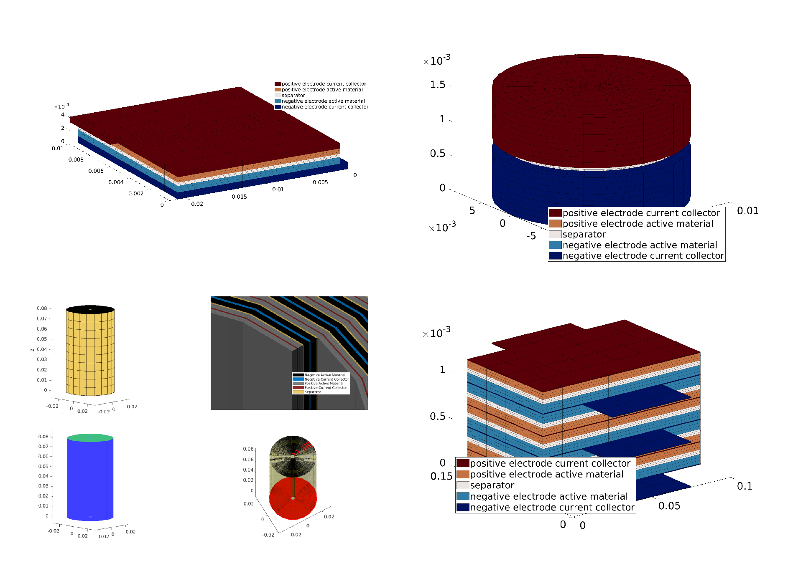

<!-- To compile this file, after installing docker, from this directory, run : docker run --rm --volume $PWD:/data --user $(id -u):$(id -g) --env JOURNAL=joss openjournals/inara  -->
# Summary

This paper presents the Battery Modelling Toolbox (BattMo), a flexible finite volume continuum modelling framework for
simulating the performance of electrochemical cells. BattMo can quickly setup and solve models for a variety of battery
chemistries, even considering complex designs like cylindical and prismatic cell jelly rolls.

The simulation input parameters, including the material parameters and geometric descriptions, are specified through
json schemas. In this respect, we follow the guidelines of the Battery Interface Ontology (BattINFO) to support semantic
interoperability in accordance with the FAIR principles. 

The Doyle-Fuller-Newman (DFN) [@Doyle1993ModelingCell] approach is used as a base model. We include fully coupled
thermal simulations. It is possible to include degradation mechanisms such as SEI layer growth) and the use of composite
material, such as a mixture of Silicon and graphite.

The models are setup in a hierarchical way, for clarity and modularity. Each model corresponds to a computational graph,
which indroduces a set of variables (the nodes) and functional relationship (the edges). This design enables the
flexibility for changing and designing new models. This flexibility is also illustrated in the implementation of an
electrolyser model.

The solver in BattMo uses automatic differentiation and support adjoint computation. We can therefore computute the
derivative of objective functions with respect to all parameters in a very efficient way. Gradient-based optimization
routine can be used to compute parameters from experimental data by minimizing the difference between observed and
predicted results.

# Statement of need

New high-performance battery designs are essential to achieve the goals of the electric energy transition. Developing
rigorous digital workflows can help industrial and research institutions reduce the need for costly physical prototyping
and derive greater insight and knowledge from their data.

There is a clear need for a battery modelling framework which can be adapted for both Li-ion and post-Li-ion
technologies and can simulate the performance of battery cells in full three-dimensional designs. Recently, a variety of
open-source battery modelling codes have been released including PyBaMM [@sulzer2021python], cideMOD
[@CiriaAylagas2022], LIONSIMBA [@torchio2016lionsimba], PETLion [@Berliner_2021], and MPET, among others. These
open-source modelling frameworks help the battery community reduce the cost of model development and help ensure the
validity and the reproducibility of findings.

BattMo prolongs this effort by supporting fully 3D geometry and includes the possibility to easily modify the underlying
equations. We provide a library of standard battery geometry which is parameterize. Design optimization can also be done
on the geometry, which is an essential part of the design.

A challenge for physically based model for battery is the difficulty to calibrate the parameters. With an adjoint-based
approach, we can effectively calibrate the models from experiments in a reasonable computationtime.

# Functionality overview

The default and easiest way to send the input parameters for the simulator is by using a json file. The json format is a
text based format, which means that the file can be read directly by the user and easily modify. The keywords used in a
BattMo json input file are all specified through a set of Json schema. 

List of features

- Standard data input (json based with schema)
- Library of battery format (to be extended)
- Flexible model design 
- Visualization
- Parameter calibration
- Design optimization
- Support for standard protocols (control switching, to be soon merged...)
- SEI layer growth model
- Composite material model
- Material database
- Silicon swelling (to be soon merged...)

# Software dependencies

BattMo builds on the MATLAB Reservoir Simulation Toolbox [@MRST:2025] which provides a reliable foundation for meshing
intricate geometries, efficiently solving large systems of equations, and visualizing the results. It is implemented in
Matlab/Octave. We do not rely on extra packages in matlab so that the basic license is enough. We use AMG open-source
preconditionner from AMGCL [@Demidov2020].

# Battery Format library

We support coin cell, multipouch cell and prismatic jelly roll cell. The geometry are parameterized and can be modified
using a simple set of parameters (the gridding is included in the setup).

{width=100%}

# Graph based modeling

# Baseline P2D example

We use Chen data. We match pybamm simulation. 

Example where we can easily change chemistry

# Thermal P4D fully coupled simulation

Multipouch cell, includes thermal, boundary conditions

# Optimization using adjoint

Calibration methods

# Composite material

# Acknowledgements

We acknowledge contributions from the EU, Grant agreements 101069765, 875527, 101104013, 101103997

# References
