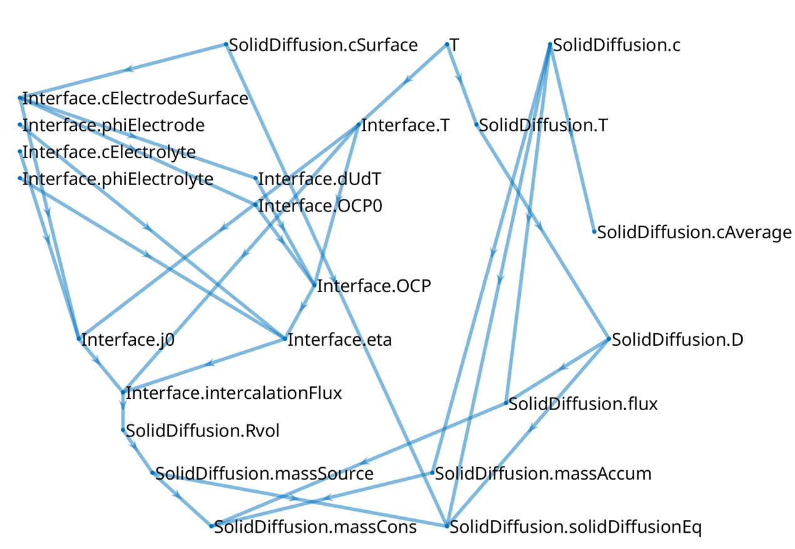

<!-- To compile this file, after installing docker, from this directory, run : docker run --rm --volume $PWD:/data --user $(id -u):$(id -g) --env JOURNAL=joss openjournals/inara  -->
# Summary

This paper presents the Battery Modelling Toolbox (BattMo), a flexible finite volume continuum modelling framework in MATLAB$^®$ [@MATLAB] for
simulating the performance of electro-chemical cells. BattMo can quickly setup and solve models for a variety of battery
chemistries, even considering 3D designs such as cylindrical and prismatic cells.

The simulation input parameters, including the material parameters and geometric descriptions, are specified through
JSON schemas. In this respect, we follow the guidelines of the Battery Interface Ontology (BattINFO) to support semantic
interoperability in accordance with the FAIR principles [@fair].

The Doyle-Fuller-Newman (DFN) [@Doyle1993ModelingCell] approach is used as a base model. We include fully coupled
thermal simulations. It is possible to include degradation mechanisms such as SEI layer growth, and the use of composite
material, such as a mixture of Silicon and graphite.

The models are setup in a hierarchical way, for clarity and modularity. Each model corresponds to a computational graph,
which introduces a set of variables (the nodes) and functional relationship (the edges). This design enables the
flexibility for changing and designing new models.

The solver in BattMo uses automatic differentiation and support adjoint computation. We can therefore compute the
derivative of objective functions with respect to all parameters efficiently. Gradient-based optimization
routines can be used to calibrate parameters from experimental data.

# Statement of need

New high-performance electro-chemical systems such as Li-ion and post-Li-ion batteries are essential to achieve the goals of the electric energy transition. Developing
rigorous digital workflows can help industrial and research institutions reduce the need for physical prototyping
and derive greater insight and knowledge from their data.

Recently, a variety of
open-source battery modelling codes have been released including PyBaMM [@sulzer2021python], cideMOD
[@CiriaAylagas2022], LIONSIMBA [@torchio2016lionsimba], and PETLion [@Berliner_2021], among others. These
open-source frameworks help the community reduce the cost of model development and help ensure the
validity and the reproducibility of findings.

BattMo prolongs this effort by supporting fully 3D geometry and the possibility to easily modify the underlying
equations. We provide a library of standard parameterized battery geometries. Design optimization can also be done
on the geometry, which is an essential part of the design.

A challenge for physics-based models for battery and other electro-chemical systems is the difficulty to calibrate the parameters. With an adjoint-based
approach, we can effectively calibrate the models from experiments in a reasonable computational time.

# Functionality overview

The main features of BattMo is summarized in the following list:

- JSON based input with schema
- Library of parameterized battery formats
- Flexible graph-based model design
- Fully coupled electro-chemical--thermal models
- 3D visualization
- Parameter calibration
- Design optimization
- Support for standard protocols such as CC, CV, CCCV, and time series
- SEI layer growth model
- Composite material model
- Silicon swelling model
- Material database for NMC, NCA, LFP, LNMO, SiGr, electrolytes, etc
- Alkaline membrane electrolyser model
- Proton ceramic membrane model

# Software dependencies

BattMo builds on the MATLAB Reservoir Simulation Toolbox [@mrst-book-i] which provides the foundation for meshing
intricate geometries, solving large nonlinear systems of equations, visualizing the results, etc. It is implemented in
MATLAB$^®$ and we seek to provide Octave [@octave] compatibility. Neither BattMo nor MRST rely on extra MATLAB$^®$ packages; the basic license is sufficient. We do recommend using AMG preconditioners from the open-source
AMGCL library [@Demidov2020] for fast, multi-threaded solution of linear systems.

# Battery format library

We support coin cells, jelly roll cells and multi-pouch cells with different tab layouts. The geometries are parameterized and can be modified
using a simple set of parameters. 1D and 2D grids for P2D and P3D models can also be generated.

{width=100%}

# Graph based model development

BattMo has the ambition to support a variety of electro-chemical systems. The complexity of such models increases rapidly as models are extended or coupled. To manage this, BattMo introduces a computational graph-based model design. Each model is defined as a graph whose nodes represent variables and whose directed edges represent their functional relationships. A model is ready for simulation when the graph’s roots are the governing variables and its leaves the governing equations. Interactive tools are available to explore these graphs.

Model hierarchy is an essential part of the framework. Coupling two models is done by creating a new coupling model that contains both as sub-models. Their graphs become sub-graphs, and new edges are added to represent coupling mechanisms, allowing most sub-models to remain unchanged. For more details, see the [documentation](https://battmo.org/BattMo/computationalGraph/graphdoc.html).

{width=80%}

# Examples

Numerous documented and tested examples are provided with the code and demonstrates the features listed above. We seek to be cross-compatible, allowing for any chemistry and material combination with any battery format. A selection of the examples are documented at [https://battmo.org/BattMo/](https://battmo.org/BattMo/). The complete list of examples are available at [https://github.com/BattMoTeam/BattMo/tree/main/Examples](https://github.com/BattMoTeam/BattMo/tree/main/Examples). <!--  -->

# BattMo family

The following software include the BattMo family:

| Software                                             | Description                                                         |
|------------------------------------------------------|---------------------------------------------------------------------|
| [BattMo](https://github.com/BattMoTeam/BattMo)       | MATLAB$^®$ version presented in this publication |
| [BattMo.jl](https://github.com/BattMoTeam/BattMo.jl) | Julia version                                                       |
| [PyBattMo](https://github.com/BattMoTeam/PyBattMo)   | Python wrapper around BattMo.jl                                     |
| [BattMoApp](https://app.battmo.org/)                 | Web-application built on top of BattMo.jl                           |

# Acknowledgements

We acknowledge contributions from the European Union, Grant agreements 101069765 (IntelLiGent), 875527 (HYDRA), 957189 (BIG-MAP), 101104013 (BATMAX) and 101103997 (DigiBatt).

# References
