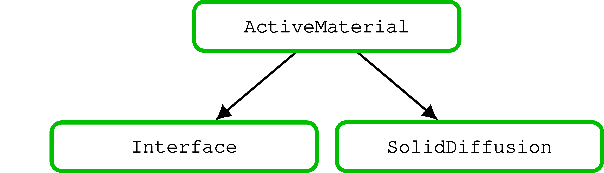

=========================
BattMo Model Architecture
=========================

We use a multi-model approach. The models are organized in a hierarchy, meaning that a given model can have
sub-models. A model is supposed to define all the functions and variables that will be needed to simulate a physical
system separately. At the top, we have a battery model with the submodels:

* Negative electrode model
* Positive electrode model
* Electrolyte model
* Separator model
* ThermalModel model
* Control model

.. figure:: img/cutbatterygraph.png
   :target: _images/cutbatterygraph.png

The **negative and positive electrodes** are instances of the same electrode model. The electrode model has two sub-models:

* Coating model
* Current Collector model (optional)

.. figure:: img/electrodegraph.png
   :target: _images/electrodegraph.png
   :width: 50%
   :align: center

The **coating model** has three sub-models:

* Active material model
* Binder
* Conductive additive model

.. figure:: img/coatinggraph.png
   :target: _images/coatinggraph.png
   :width: 70%
   :align: center
   :class: with-border

           
In the case of a composite material, the coating model will have a different structure with two active material models
(see :todo:`add link`)

The **Active Material** is organized two sub-models

* Interface
* SolidDiffusion

           
We have implemented two solid diffusion model :todo:`add more`

The **Control**, **Separator** and **Thermal** models do not have sub-models.
           
.. toctree::
   :hidden: 

   Battery <batteryinput>

