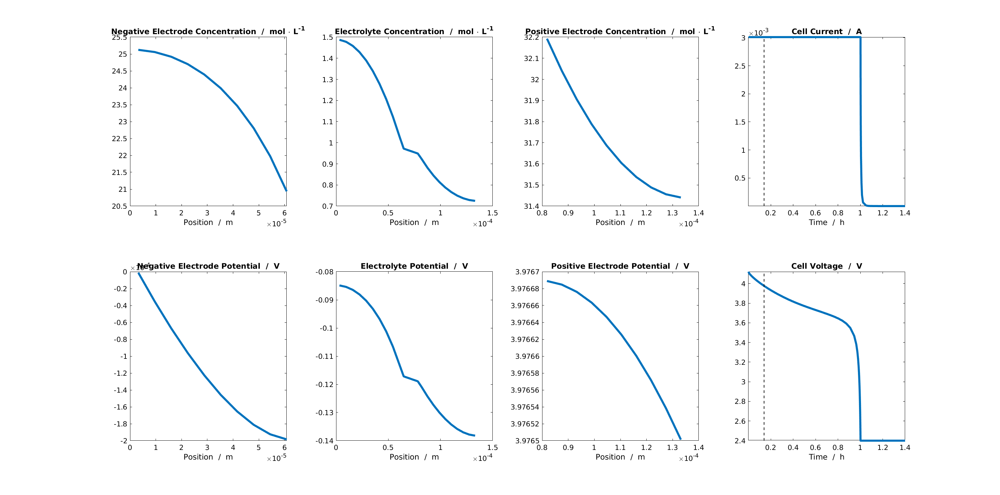

===========
Basic Usage
===========

In this section, we describe how to run |battmo| using json inputs. The specification of json inputs is described in :ref:`json:Json input specification`

Standard Run
============

First, we load and parse the json input file using the commands

.. code:: matlab

   jsonstruct = parseBattmoJson('input.json')

Then, we run it as follows
  
.. code:: matlab

   output = runBatteryJson(jsonstruct)
                      
The json file :code:`input.json` given :ref:`here <jsoninputfile>` provides the needed data for the simulation. The
section :ref:`json:Json input specification` gives a complete description of each of the field. We have used long and
explicit names for a good readability.

The :code:`output` structure returns among other thing the model and the states. 

.. code:: matlab

   model  : [1x1 Battery]
   states : [1x1 struct]
          
We can plot the results using :battmo:`plotDashboard`. Here, for example at time step equal to 10,

.. code:: matlab

   plotDashboard(model, states, 'step', 10)

   Dashboard for the solution at a given timestep.
   
     
Modifying the Json input
========================

We can modify directly the json input by editing in the file. The json file is converted in a standard Matlab structure
using the Matlab in-built function `jsondecode <https://se.mathworks.com/help/matlab/ref/jsondecode.html>`_. We can
therefore modify it directly in matlab. Here, we modify the CRate values,

.. code:: matlab

   CRates = [0.8, 1, 2];
   for i = 1 : numel(CRates)
       jsonstruct.Control.CRate = CRates(i);
       output = runBatteryJson(jsonstruct);
       plotResult(output);
   end

For this example, we have writting a :code:`plotResult` function which extracts and plots from the output the time and
voltage values, see :ref:`here <plotResult>`.
   
.. figure:: img/crates.png
   :target: _images/crates.png
   :width: 70%
   :align: center   

Combining Json inputs
=====================

There are two mechanisms to combine json schema

We can also change the geometry. In :ref:`geometryinput:Battery Geometries`, we give an overview of the various geometrical model we
support. We start from the same json structure and switch to a 2D model. The parameters for the 2D model can be found in
the *Geometry* :ref:`geometryschema`
