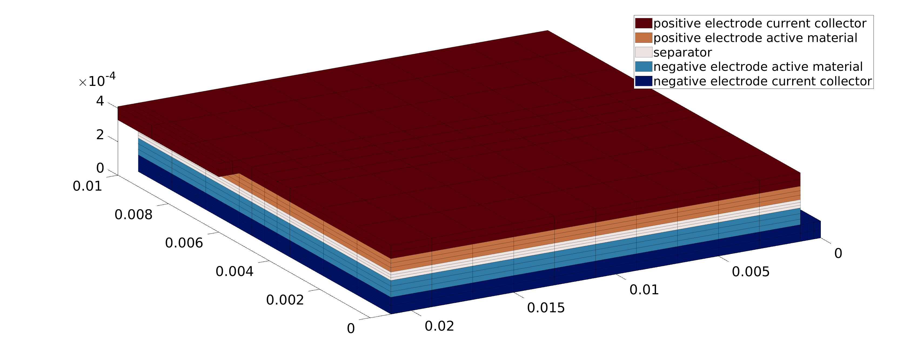

===========
Basic Usage
===========

.. note::
  This section is still under development.

In this section, we describe how to setup, run, and post-process a basic P2D Li-ion battery simulation in |battmo|.

Define Parameters
=================

|battmo| uses JSON to manage parameters. This allows you to easily save, document, and share complete parameter sets from specific simulations. We have used long and explicit key names for good readability. If you are new to JSON, you can learn more about it `here <https://www.w3schools.com/js/js_json_intro.asp>`_. Details on the BattMo specification are available in the :ref:`json:JSON input specification`.

For this example, we provide a sample JSON file :battmofile:`sample_input.json<Examples/jsondatafiles/sample_input.json>` that
describes an NMC-Graphite cell.

We load and parse the JSON input file into |battmo| using the command:

.. code:: matlab

   jsonstruct = parseBattmoJson('Examples/jsondatafiles/sample_input.json')

This transforms the parameter data as a `MATLAB structure <https://se.mathworks.com/help/matlab/structures.html>`_ :code:`jsonstruct` that is used to setup the simulation. We can explore the structure within the MATLAB Command Window by navigating the different levels of the structure. For example, if we want to know the thickness of the negative electrode coating, we can give the command:

.. code:: matlab

   jsonstruct.NegativeElectrode.Coating.thickness

which returns:

.. code:: matlab

   6.4000e-05

Unless otherwise specified, BattMo uses `SI base units <https://www.nist.gov/si-redefinition/definitions-si-base-units>`_ for physical quantities.

Run Simulation
==============

We can run the simulation with the command:
  
.. code:: matlab

   output = runBatteryJson(jsonstruct)
                      
Post-Process Results
====================

We can plot the results using :battmo:`plotDashboard`. Here, for example at time step 10,

.. code:: matlab

   plotDashboard(output.model, output.states, 'step', 10)

.. figure:: img/firstresult.png
   :target: _images/firstresult.png
   :width: 100%
   :align: center

   Dashboard for the solution at a given timestep.

The left 3 columns of the dashboard shows the profiles for the main state quantities (concentration and electric potential) in the negative electrode, electrolyte, and positive electrode. The rightmost column shows the calculated cell current and voltage. In the following subsections, we will explore how to access and plot this data from the simulation output.

Simulation Output
-----------------

The :code:`output` structure returns among other thing the model and the states. 

.. code:: matlab

   model  : [1x1 Battery]
   states : [1x1 struct]
          
The :code:`model` contains information about the setup of the model and initial conditions, while :code:`states` contains the results of the simulation at each timestep. Plotting the simulation results requires information about the grid (i.e. what is the position where the quantity is calculated?) and the state (i.e. what is the value of the quantity in that position at a given time?).

Explore the Grid
----------------
One of the most used properties of the model is the grid (or mesh), which can be accessed with the command:

.. code:: matlab

   output.model.G

We can see that the grid is stored as a structure with information about the cells, faces, nodes, etc. The values of the state quantities (e.g. concentration and electric potential) are calculated at the nodes. To plot the positions of the nodes, we can use the following commands:

.. code:: matlab

   x = output.model.G.cells.centroids;
   plot(x, zeros(size(x)), 'o')
   xlabel('Position  /  m')

This shows the overall grid that is used for the model. However, |battmo| models use a modular hierarchy where the overall cell model is composed of smaller submodels for electrodes, electrolyte, and current collectors. Each of these submodels has its own grid. 

For example, if we want to plot the grid associated with the different submodels in different colors, we can use the following commands:

.. code:: matlab

   x_ne = output.model.NegativeElectrode.G.cells.centroids;
   x_sep = output.model.Separator.G.cells.centroids;
   x_pe = output.model.PositiveElectrode.G.cells.centroids;

   plot(x_ne, zeros(size(x_ne)), 'o')
   hold on
   plot(x_sep, zeros(size(x_sep)), 'ok')
   plot(x_pe, zeros(size(x_pe)), 'or')
   xlabel('Position  /  m')  

Explore the States
----------------

The values of the state quantities at each time step are stored in the :code:`states` `cell array <https://se.mathworks.com/help/matlab/cell-arrays.html>`_. Each entry in the array describes the state of the simulation at a given timestep. 

For example, we can look at the state of the simulation at timestep 10 (shown in the dashboard plot above) using the command:

.. code:: matlab

   output.states{10}

which returns the structure:

.. code:: matlab

          Electrolyte: [1×1 struct]
    NegativeElectrode: [1×1 struct]
    PositiveElectrode: [1×1 struct]
              Control: [1×1 struct]
                 time: 504
         ThermalModel: [1×1 struct]

There we can see that the time of the state is 504 seconds and there are other structures containing the states of the electrodes and electrolyte. We can look into the state of the electrolyte using the command:

.. code:: matlab

   output.states{10}.Electrolyte

which shows that there are two quantities there:

.. code:: matlab

     c: [30×1 double]
   phi: [30×1 double]

We see that the size of the state quantity vectors match the size of the grid vector. 

Plot a Result
-------------

Let's plot the concentration in the electrolyte at timestep 10. We can plot the results using basic MATLAB commands this way:

.. code:: matlab
   
   x = output.model.G.cells.centroids
   c = output.states{10}.Electrolyte.c

   plot(x,c)
   xlabel('Position  /  m')
   ylabel('Concentration  /  mol \cdot m^{-3}')

|battmo| also includes dedicated plotting functions that will come in handy when we start working with more complex systems (e.g. P4D grids). We can generate the same plot using the |battmo| function :code:`plotCellData`:

.. code:: matlab

   timestep = 10

   plotCellData(output.model.G, output.states{timestep}.Electrolyte.c)
   xlabel('Position  /  m')
   ylabel('Concentration  /  mol \cdot m^{-3}')

Modifying the JSON input directly from Matlab
=============================================

We can modify directly the JSON input by editing in the file. The JSON file is converted in a standard Matlab structure
using the Matlab in-built function `jsondecode <https://se.mathworks.com/help/matlab/ref/jsondecode.html>`_. We can
therefore modify it directly in matlab. Here, we modify the CRate values,

.. code:: matlab

   CRates = [0.8, 1, 2];
   for i = 1 : numel(CRates)
       jsonstruct.Control.CRate = CRates(i);
       output = runBatteryJson(jsonstruct);
       plotResult(output);
   end

For this example, we have writting a :code:`plotResult` function which extracts and plots from the output the time and
voltage values, see :ref:`here <plotResult>`.
   
.. figure:: img/crates.png
   :target: _images/crates.png
   :width: 70%
   :align: center   

Combining JSON inputs
=====================

There are two mechanisms which can be used to combine JSON input files:

#. Direct insertion using :code:`parseBattmoJson`
#. Merge function using :code:`mergeJsonStruct`

Direct insertion using :code:`parseBattmoJson`
----------------------------------------------

The function :battmo:`parseBattmoJson` parses the JSON input to create the corresponding matlab structure, basically
relying on `jsondecode <https://se.mathworks.com/help/matlab/ref/jsondecode.html>`_. In this process the reserved
keyword properties :code:`isFile` combined with :code:`filename` are used to fetch and insert in place JSON data located
in separate files. Here is an example, taken from :battmofile:`lithium_ion_battery_nmc_graphite.json<ParameterData/BatteryCellParameters/LithiumIonBatteryCell/lithium_ion_battery_nmc_graphite.json>` where we have the following lines

.. code:: json
          
  "NegativeElectrode": {
    "Coating": {
      "ActiveMaterial": {
        "Interface": {
          "isFile": true,
          "filename": "ParameterData/MaterialProperties/Graphite/graphite.json"
        }}}}

The content of the file :battmofile:`graphite.json<ParameterData/MaterialProperties/Graphite/graphite.json>` is then
inserted in place. Hence, when we write

.. code:: matlab

   filename = fileread('ParameterData/BatteryCellParameters/LithiumIonBatteryCell/lithium_ion_battery_nmc_graphite.json')
   jsonstruct = parseBattmoJson(filename)

the :code:`jsonstruct` that is obtained is equivalent to the one where we would have copied and paste the content of
:battmofile:`graphite.json<ParameterData/MaterialProperties/Graphite/graphite.json>`.

.. collapse:: jsonstruct detail

   .. code:: json
             
     "NegativeElectrode": {
       "Coating": {
         "ActiveMaterial": {
           "Interface": {
             "saturationConcentration": 30555,
             "volumetricSurfaceArea": 723600,
             "density": 2240,
             "numberOfElectronsTransferred" : 1,
             "activationEnergyOfReaction": 5000,
             "reactionRateConstant": 5.031e-11,
             "guestStoichiometry100": 0.88551,
             "guestStoichiometry0": 0.1429,
             "chargeTransferCoefficient": 0.5,
             "openCircuitPotential" : {"type": "function",
             "functionname" : "computeOCP_graphite",
             "argumentlist" : ["cElectrode", "T", "cmax"]
             }}},          

.. _mergeJsonStructs:

Merge function using :code:`mergeJsonStructs`
---------------------------------------------

We have implemented in Matlab a simple function that merge JSON files (feel free to implement it in your favorite
languages). The function :battmo:`mergeJsonStructs` takes a cell array of JSON structure parsed with `jsondecode
<https://se.mathworks.com/help/matlab/ref/jsondecode.html>`_ or :battmo:`parseBattmoJson` and merge the fields.

Let us look at an example where we change the geometry.  In :ref:`geometryinput:Battery Geometries`, we give an overview
of the various geometrical model we support.

We use the same material parameters as in the previous case,

.. code:: matlab
          
   jsonfilename = 'ParameterData/BatteryCellParameters/LithiumIonBatteryCell/lithium_ion_battery_nmc_graphite.json';
   jsonstruct_material = parseBattmoJson(jsonfilename);

Let us consider the :code:`3d-demo` :ref:`case<3dgeometry>`. The 3D model can be found in the :battmofile:`Geometry
Schema<Utilities/JsonSchemas/Geometry.schema.json#113>`. We use the parameters given in
:battmofile:`geometry3d.json<Examples/jsondatafiles/geometry3d.json>` and fetch those using

.. code:: matlab
          
   jsonfilename = 'Examples/jsondatafiles/geometry3d.json';
   jsonstruct_geometry = parseBattmoJson(jsonfilename);            

We merge the two JSON inputs by calling

.. code:: matlab

   jsonstruct = mergeJsonStructs({jsonstruct_geometry , jsonstruct_material})

Now we have a JSON structure :code:`jsonstruct` that contains material properties and geometry obtained from two
separate files. After adding the rest of the simulation inputs as done in :battmo:`runJsonScript`, the simulation can be
run as before by running

.. code:: matlab

   output = runBatteryJson(jsonstruct);

We plot the model using :battmo:`plotBatteryMesh` (note that the different axis are scaled differently)

.. code:: matlab
          
   model = output.model
   plotBatteryMesh(model)

   
We find a extensive set of plotting functions in `MRST <https://www.sintef.no/Projectweb/MRST/>`_. You may be interested
to have a look at the `Visualization Tutorial
<https://www.sintef.no/projectweb/mrst/documentation/tutorials/visualization-tutorial/>`_. Let us use the
:mrstfile:`plotGrid<core/plotting/plotGrid.m>` and :mrstfile:`plotCellData<core/plotting/plotCellData.m>` to plot the
surface particle concentrations in both electrode at a given time step.
          
..
   The plots presented below are obtained using the script runExample3D in Documentation/scripts/runExample3D

.. code:: matlab
          
   state = output.states{20};
   E = state.Control.E
   plotGrid(model.G, 'facecolor', 'none', 'edgealpha', 0.1)
   plotCellData(model.NegativeElectrode.Coating.G, state.NegativeElectrode.Coating.ActiveMaterial.SolidDiffusion.cSurface/(mol/litre))
   plotCellData(model.PositiveElectrode.Coating.G, state.PositiveElectrode.Coating.ActiveMaterial.SolidDiffusion.cSurface/(mol/litre))
   title('Particle Surface Lithium Concentration');

.. figure:: img/3dconc.png
   :target: _images/3dconc.png
   
