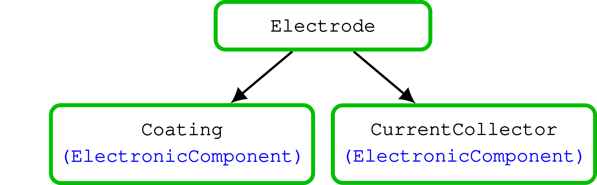

Battery cell
============

A battery consists of two electrodes and an electrolyte.

Each are implemented by a model which takes its own set of input parameters.

The convention for the input model class names is to write them using the model name followed by the suffix
:code:`InputParams`. In the graph below, we can see that the battery model has submodel instances as properties. The
property names are in black color while the model they belong to is in blue.

.. figure:: img/cutbatterygraph.png
   

.. class:: BatteryInputParams

   This class is used to set up the battery model input parameters

   .. rubric:: Sub Models:

   .. attribute:: NegativeElectrode
       
      Negative Electrode Model, instance of :class:`ElectrodeInputParams`
       
   .. attribute:: PositiveElectrode
       
      Positive Electrode Model, instance of :class:`ElectrodeInputParams`

   .. attribute:: Electrolyte
                  
      Electrolyte model, instance of :class:`ElectrolyteInputParams`
       
   .. attribute:: Separator
       
      Separator model, instance of :class:`SeparatorInputParams`
       
   .. attribute:: ThermalModel
       
      Thermal model, instance of :class:`ThermalComponentInputParams`

   .. attribute:: Control
                  
      Control Model, instance of :class:`ControlInputParams`

                   
Electrode
=========

An electrode consists of an active material, which contains an interface model and a solid diffusion model, and a
current collector. Each of those components have a own set of input parameters.

.. class:: ElectrodeInputParams

   Class used to setup the parameters for the electrode

   .. rubric:: Sub Models
               
   .. attribute:: Coating

      Instance of :class:`CoatingInputParams`
                  
   .. attribute:: CurrentCollector
           
      Instance of :class:`CurrentCollectorInputParams`

            
Coating
=======

The coating contains three components : The active material, a binder and a conductive additive

.. figure:: img/coatinggraph.png

.. class:: CoatingInputParams

   Class used to set the parameters for the coating material

   .. rubric:: Sub Models:
               
   .. attribute:: ActiveMaterial

      Instance of :class:`ActiveMaterialInputParams`
                  
   .. attribute:: Binder
           
      Instance of :class:`BinderInputParams`
                  
   .. attribute:: ConductingAdditive
           
      Instance of :class:`ConductingAdditiveInputParams`

Active Material
===============

.. figure:: img/activematerialgraph.png

.. class:: ActiveMaterialInputParams

   Class used to setup the active material parameters
           
   .. rubric:: Sub Models:
   
   .. attribute:: Interface

      Instance of :class:`InterfaceInputParams`
                  
   .. attribute:: SolidDiffusion

      Instance of :class:`FullSolidDiffusionInputParams` or :class:`SimpleSolidDiffusionInputParams`
                  
   .. rubric:: Input parameters:
   
   .. attribute:: electronicConductivity

      the electronic conductivity of the material (symbol: sigma)
      
   .. attribute:: density

      the mass density of the material (symbol: rho)
      
   .. attribute:: massFraction

      the ratio of the mass of the material to the total mass of the phase or mixture (symbol: gamma)

   .. attribute:: thermalConductivity

      the intrinsic Thermal conductivity of the active component
      
   .. attribute:: specificHeatCapacity

      Specific Heat capacity of the active component
      
   .. attribute:: diffusionModelType

      diffusion model type, either 'full' or 'simplified'

      
Binder
======

.. class:: BinderInputParams

   Class used to setup the binder parameters
   
   .. attribute:: electronicConductivity

      the electronic conductivity of the material (symbol: sigma)

   .. attribute:: density

      the mass density of the material (symbol: rho)

   .. attribute:: massFraction

      the ratio of the mass of the material to the total mass of the phase or mixture (symbol: gamma)

   .. attribute:: thermalConductivity

      Thermal conductivity of current collector

   .. attribute:: specificHeatCapacity

      Heat capacity of current collector           
           

Conducting Additive
===================

.. class:: ConductingAdditiveInputParams

   Class used to setup the binder parameters
   
   .. attribute:: electronicConductivity

      the electronic conductivity of the material (symbol: sigma)

   .. attribute:: density

      the mass density of the material (symbol: rho)

   .. attribute:: massFraction

      the ratio of the mass of the material to the total mass of the phase or mixture (symbol: gamma)

   .. attribute:: thermalConductivity

      Thermal conductivity of current collector

   .. attribute:: specificHeatCapacity

      Heat capacity of current collector
           

Interface
=========

The interface model is used to compute the quantities that arise from the chemical reaction between the solid electrode
and electrolyte.

.. class:: InterfaceInputParams

   Class used to setup parameters for the interface

   .. attribute:: saturationConcentration

      the saturation concentration of the guest molecule in the host material
           
   .. attribute:: numberOfElectronsTransferred

      stoichiometric number of electrons transferred in the electrochemical reaction
           
   .. attribute:: volumeFraction

      volume fraction of the active material
           
   .. attribute:: volumetricSurfaceArea

      surface area of the active material - electrolyte interface per volume of electrode
           
   .. attribute:: activationEnergyOfReaction

      the activation energy of the electrochemical reaction
           
   .. attribute:: reactionRateConstant

      the reaction rate constant of the electrochemical reaction

   .. attribute:: exchangeCurrentDensity
        
   .. attribute:: guestStoichiometry100

      the ratio of the concentration of the guest molecule to the saturation concentration of the guest molecule in a phase at a cell voltage that is defined as 100% SOC
           
   .. attribute:: guestStoichiometry0

      the ratio of the concentration of the guest molecule to the saturation concentration of the guest molecule in a phase at a cell voltage that is defined as 0% SOC
           
   .. attribute:: density

      the mass density of the active material
           
   .. attribute:: openCircuitPotential
        
   .. attribute:: chargeTransferCoefficient

      the charge transfer coefficient that enters in the Butler-Volmer equation (symbol: alpha)
           
      
Solid Diffusion Models
======================

Two solid diffusion models are implemented: full and simplified.

.. class:: SolidDiffusionModelInputParams

   Parent class shared shared by both :class:`FullSolidDiffusionInputParams` and :class:`SimplifiedSolidDiffusionInputParams`

   .. attribute:: particleRadius

      the characteristic radius of the particle (symbol: rp)

   .. attribute:: activationEnergyOfDiffusion

      the Arrhenius-type activation energy for diffusion (symbol: EaD)

   .. attribute:: referenceDiffusionCoefficient

      the pre-exponential reference diffusion coefficient in an Arrhenius-type equation (symbol: D0)

   .. attribute:: volumetricSurfaceArea

      surface area of the active material - electrolyte interface per volume of electrode   

.. class:: FullSolidDiffusionModelInputParams

   Class used to setup the parameter for the solid diffusion model
   
   .. attribute:: diffusionCoefficient

      the solid diffusion coefficient

   .. attribute:: saturationConcentration

      the saturation concentration of the guest molecule in the host material (symbol: cmax)

   .. attribute:: guestStoichiometry100

      the ratio of the concentration of the guest molecule to the saturation concentration of the guest molecule in a phase at a cell voltage that is defined as 100% SOC(symbol: theta100)

   .. attribute:: guestStoichiometry0

      the ratio of the concentration of the guest molecule to the saturation concentration of the guest molecule in a phase at a cell voltage that is defined as 0% SOC (symbol: theta0)
           

.. class:: SimplifiedSolidDiffusionModelInputParams

   Class to setup the parameters for the simplified solid diffusion model. It does not have more properties than the parent class :class:`SolidDiffusionModelInputParams`

Electrolyte
===========

.. class:: ElectrolyteInputParams

   Class used to setup the input parameters for the electrolyte.
   
   .. attribute:: density

      the mass density of the material (symbol: rho)

   .. attribute:: ionicConductivity

      a function to determine the ionic conductivity of the electrolyte under given conditions (symbol: kappa)

   .. attribute:: diffusionCoefficient

      a function to determine the diffusion coefficient of a molecule in the electrolyte under given conditions (symbol: D)        

   .. attribute:: bruggemanCoefficient

      the coefficient for determining effective transport parameters in porous media (symbol: beta)

   .. attribute:: thermalConductivity

      Intrinsic Thermal conductivity of the electrolyte

   .. attribute:: specificHeatCapacity

      Specific Heat capacity of the electrolyte

Current Collector
=================
      
.. class:: CurrentCollectorInputParams
           
   Class used to setup the input parameters for the current collector.
   
   .. attribute:: thermalConductivity

      Thermal conductivity of current collector

   .. attribute:: specificHeatCapacity

      Heat capacity of current collector

   .. attribute:: density

      Density of current collector [kg m^-3]

   
Electronic Component
====================

Base model for all component with a electrical potential and a charge conservation equation

.. class:: ElectronicComponentInputParams

   Class to setup the parameter for a generic electronic component

   .. attribute:: electronicConductivity

      electronic conductivity
