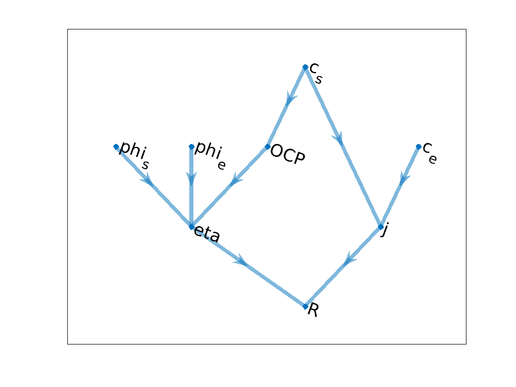
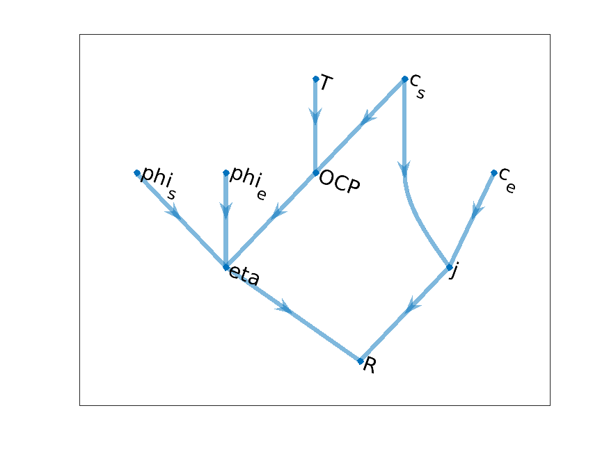
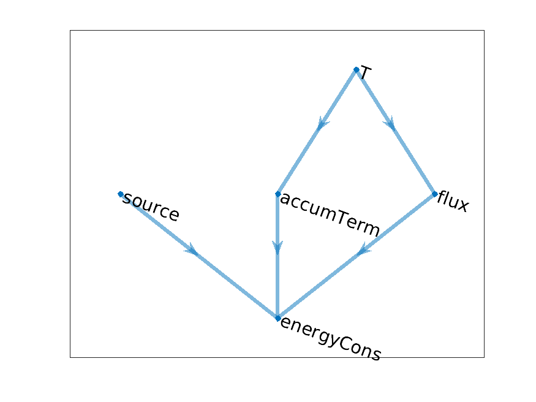
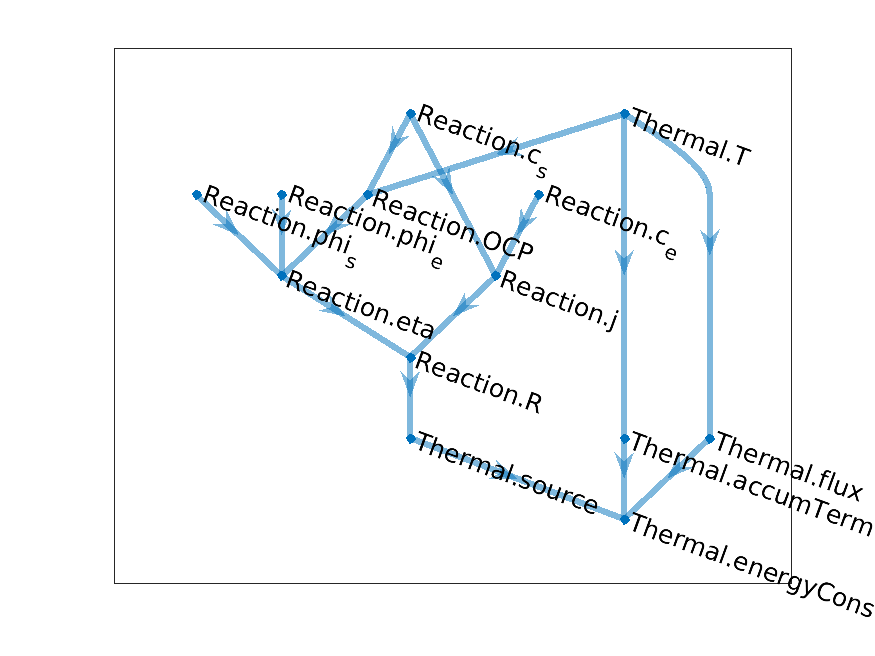
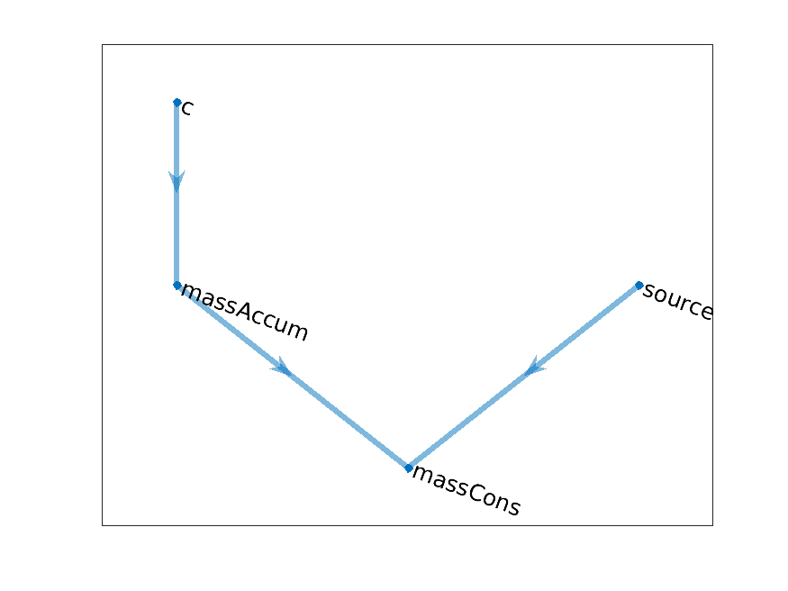
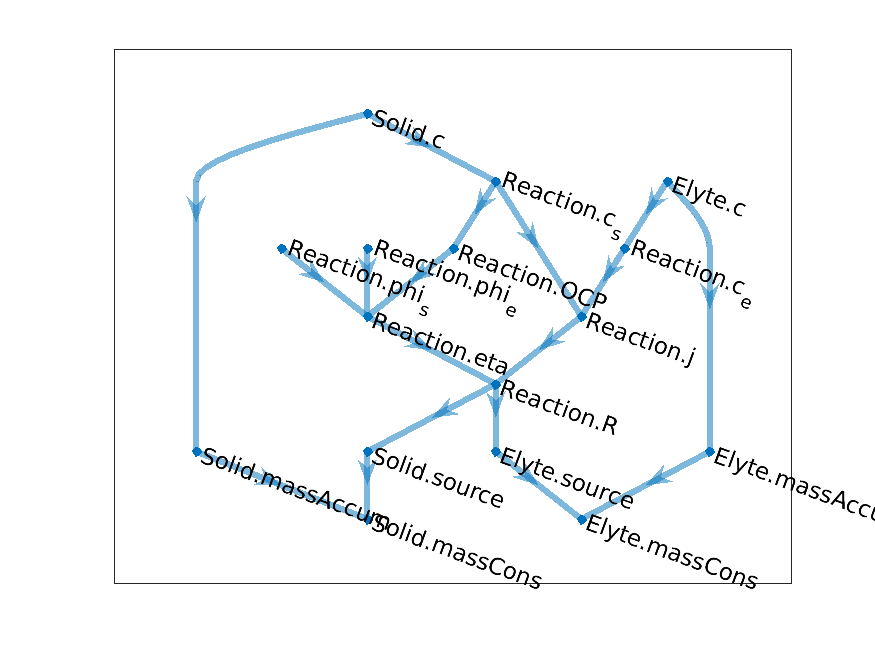
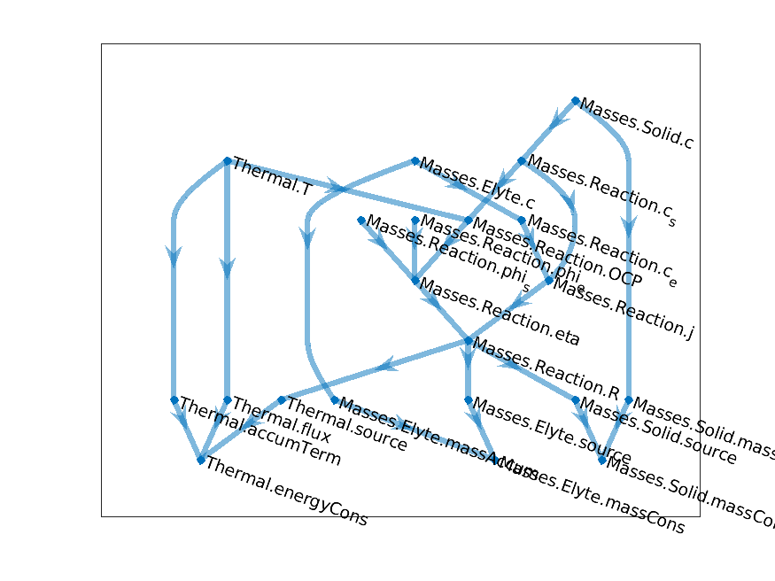
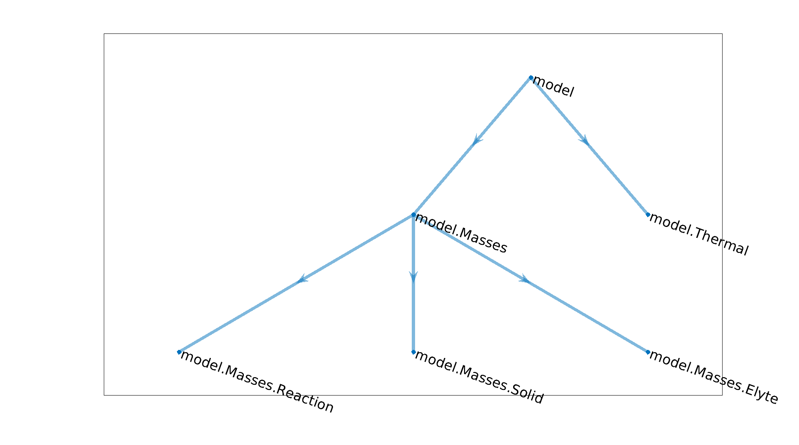
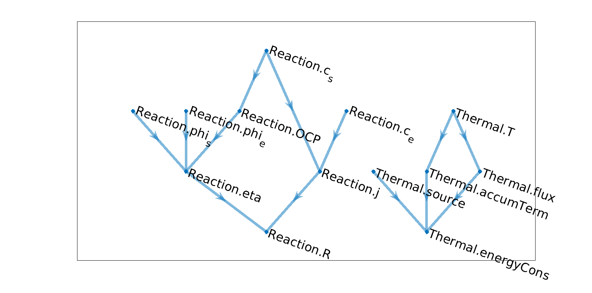

===========================================
Computation Graph Model Design ang Assembly
===========================================

We essentially define a model as a computational graph. We have identified variables. Variables are dependent one from
the other. The dependence can be explicit or implicit. In the explicit case, a variable can be directly computed from
the other using a function evaluation. In the implicit case, such function does not exist in a simple form. The
relationship between the variables is given through equations. The purpose of our simulations is to solve these
equations. The equations are added to the system of non-linear equation we solve, at each time step in the case of an
evolution problem.

In the computational graph, the nodes are given by the variables in the model. The directed edges represent the
functional dependency between the variables.

The :battmo:`ComputationalGraphTool` class has two functions

1. Serve as an **interactive** tool to design, manipulate and explore the computational graph of a model. The interactive functions can be discovered by running the method :code:`help` (see below).
2. From the computational graph, **automatically** identify
   
   1. The unknown of the problems, also called *primary variables*. They corresponds to the root in the graph (see below)
   2. The *equations*, which are the variables located at the tail of the graph. The equations are solved when the value of the equation variables are equal to zero
   3. The function calls and the order they should be called to update all the intermediate variables that directly or indirectly enter in the definition of the equation.
      
   

A simple introduction example
=============================

Let us consider the example of a reaction model. The reaction rate :math:`R` is given
by

.. math::
   :nowrap:

   \begin{align*}
   R &= j\left(e^{-\alpha\frac{\eta}{RT}} + e^{(1-\alpha)\frac{\eta}{RT}}\right)\\
   j&= k c_s(1 - c_e)^{\frac12}c_e^\frac12\\
   \eta &= \phi_s - \phi_e - \text{OCP}\\
   \text{OCP} &= \hat{\text{OCP}}(c_s)
   \end{align*}

We have seven variables :math:`R,\ j, \eta, \text{OCP}, \phi_s, \phi_e, c_s, c_e`. The dependency graph we
obtain from the equations above is

   Reaction model graph

This graph has been obtained in BattMo after we implemented the model. We will explain later how this can be
done (for the impatient, see here)

The graph is a `directed acyclic graph <https://en.wikipedia.org/wiki/Directed_acyclic_graph>`_, meaning that
it has no loop. We can thus identify *root* and *tail* variables. In the case above, the root variables are
:math:`\phi_s, \phi_e, c_s, c_e` and there only one tail variable, :math:`R`. Given values for the root
variables, we can traverse the graph and evaluate all the intermediate variables to compute the tail
variables. To evaluate variables, the functions we will implement will always need parameters (the opposite
case where a function can be defined without any external parameters is expected to be rare in a physical
context). Then, we can describe our model with

* A set of parameters (scalar variables, but maybe also functions)
* A computational graph
* A set of functions associated to each node (i.e. variable) which as an incoming edge in the computational
  graph

For each of the function in the set above, we know the input and output arguments. They are given by the nodes
connected by the edge.

The motivation for introducing suuch graph representation is **expressivity**. It provides a synthetic overview
of the model. Of course, the precise expression of the functions, which is not visible in the graph, is an
essential part. All the physics is encoded there. But, the graph gives us access to the dependency between the
variables and the variables have been chosen by the user in the model because of their specific physical
meaning. The user has chosen them from a physical insight, that we want to preserve. Especially when we expand
the models. In our previous examples, the variables we have introduced have all a name meaningfull for the
expert in the domains.

 +--------------+--------------------------------------+
 | R            | Reaction Rate                        |
 +--------------+--------------------------------------+
 | j            | Exchange Current Density             |
 +--------------+--------------------------------------+
 | eta          | Over-potential                       |
 +--------------+--------------------------------------+
 | OCP          | Open Circuit Potential               |
 +--------------+--------------------------------------+
 | phi_s, phi_e | Solid and Electrolyte potentials     |
 +--------------+--------------------------------------+
 | c_s, c_e     | Solid and Electrolyte concentrations |
 +--------------+--------------------------------------+

A user can inspect a given model first by looking at the graph, recognized the variables that are named
here. They should be meaningfull to him, as they should have been chosen to correspond to a given domain
expertise terminology (here electrochemistry).

Let us now see how we can compose computational graph

Graph composition
=================

This model representation as a graph brings also **flexibility** in model building and in particular **code
reusability**. A user who wants to modify an existing model will typically be interested in keeping most of the
existing models, and reuse the variable update functions that are been defined there. Looking at the graph, we
can understand the dependency easily and identify the part that should be changed in the model. In some cases,
the dependency graph may not changed, only a different function should be called to update a variable. For
example, the exchange current density function :math:`j` rarely obeys the ideal case presented above but is a
given tabulated function,

.. math::

   j(c_e, c_s) = \hat{j}(c_s, c_s)

where :math:`\hat{j}` is a given function the user has set up. Such function is an example of a functional
parameter belonging to the model, which we mentioned earlier.

Continuing with the same example, we may introduce a temperature dependency in the OCP function. We have

.. math::

   \text{OCP} = \hat{\text{OCP}}(c_s, T)

Then, we have to introduce a new node (i.e. variable) in our graph, the temperature :code:`T`.

   Reaction model graph with added temperature

Let us introduce an other model, at least its computational graph. We consider a simple heat equation

.. math::

   \alpha T_t = \nabla\cdot(\lambda \nabla T) + q

We introduce in addition to the temperature :code:`T` the following variable names (nodes) and, in the right
column, we write the definition they will take after discretization. The operators :code:`div` and
:code:`grad` denotes the discrete differential operators used in the assembly.

 +------------+--------------------------------------------------------------------+
 | accumTerm  | :math:`\alpha\frac{T - T^0}{\Delta t}`                             |
 +------------+--------------------------------------------------------------------+
 | flux       | :math:`-\lambda\text{grad}(T)`                                     |
 +------------+--------------------------------------------------------------------+
 | sourceTerm | :math:`q`                                                          |
 +------------+--------------------------------------------------------------------+
 | energyCons | :math:`\text{accumTerm} + \text{div}(\text{flux}) + \text{source}` |
 +------------+--------------------------------------------------------------------+

The computational for the temperature model is given by

   Temperature model graph
             
Having now two models, we can illustrate how we can combine the corresponding computational graph to obtain a
coupled model. Let us couple the two models in two ways. We include a heat source produced by the chemical
reaction, as some function of the reaction rate. The effect of the temperature on the chemical reaction is
included, as we presented earlier, as a additional temperature dependence of the open circuit potential
:code:`OCP`. We obtain the following computational graph

   Coupled Temperature Reaction model graph

In the node names, we recognize the origin of variable through a model name, either :code:`Reaction` or
:code:`Thermal`. We will come back later to that.

With this model, we can setup our first simulation. Given the concentrations and potentials, we want to obtain
the temperature, which can only obtained implicitely by solving the energy equation. Looking at the graph, we
find that the root variables are :code:`Thermal.T`, :code:`Reaction.c_s`, :code:`Reaction.phi_s`,
:code:`Reaction.c_e`, :code:`Reaction.phi_e`. The tail variable is the energy conservation equation
:code:`energyCons`. A priori, the system looks well-posed with same number of unknown and equation (one of
each). At this stage, we want our implementation to automatically detects the primary variables (the root node,
:code:`T`) and the equations (the tail node, :code:`energyCons`) and to proceed with the assembly by traversing
the graph. We will later how it is done.

To conclude this example, we introduce a model for the concentrations and make them time dependent. In the
earlier model, the concentrations were kept constant because, for example, access to an infinite reservoir of
the chemical species. Now, we consider the case of a closed reservoir and the composition evolve accordingly to
the chemical reaction. We have equations of the form

.. math::

   \begin{align*}
   \frac{dc_s}{dt} &= R_s, & \frac{dc_r}{dt} &= R_e 
   \end{align*}
   
where the right-hand side is obtained from the computed reaction rate, following the stoichiometry of the
chemical reactions.

The computational grap for each of this equation take the generic form

   Concentration model graph

where

 +------------+--------------------------------------+
 | masssAccum | :math:`\frac{c - c^0}{\Delta t}`     |
 +------------+--------------------------------------+
 | source     | :math:`R`                            |
 +------------+--------------------------------------+
 | massCons   | :math:`\frac{c - c^0}{\Delta t} - R` |
 +------------+--------------------------------------+

Let us now combine this model with the first one, which provided us with te computation of the chemical
reaction rate. We need two instance of the concentration model. To solve, the issue of **duplicated** variable
name, we add indices in our notations but this cannot be robustly scaled to large model. Instead, we introduce
model names and a model hierarchy. This was done already earlier with the :code:`Thermal` and :code:`Reaction`
models. Let us name our two concentration models as :code:`Solid` and :code:`Elyte`. We obtain the following
graph.

   Coupled reaction-concentration model

We note that it becomes already difficult to read off the graph and it will become harder and harder as model
grow. We have developped visualization tool that will help us in exploring the model through their graphs.

Given :code:`phi_s` and :code:`phi_e`, we can solve the problem of computing the evolution of the
concentrations. The *root* nodes are the two concentrations (the potentials are known) and the *tail* nodes are
the mass conservation equations.

Finally, we can couple the model above with with the temperature, by *sewing* together the graphs. We name the
previous composite model as :code:`Masses` and keep the name of :code:`Thermal` for the thermal model. We
obtain the following

   Coupled Temperature-Concentration-Reaction graph

New computational graphs are thus obtained by connecting existing graph, using a hierarchy of model. In the
example above, the model hierarchy is given by

   Model hierarchy

The graph of a parent model is essentially composed of the graphs of its child models with the addition of a
few new edges which connect the graphs of the child models. The graph of the parent model can also bring its
own new variables.

Graph Setup and Implementation
==============================

The implementation of a model can be decomposed into two steps.

#. We setup the computational graph.
#. We implement the functions corresponding to each node with incoming edges.

Our claim is that this decomposition **breaks the complexity** in the implementation of large coupled
models. Once the two steps above are done, a Newton loop in our simulator will consist of

.. _assembly steps:

#. Instantiation of the primary variables (the root nodes) as AD (Automatic Differentiation) variables
#. Evaluation of all the functions in a order that can be infered by the graph, as it gives us the relative
   dependencie between all the variables
#. Assembly of the Jacobian obtained form the residual equations (the tail nodes)

The Jacobian matrix with the residuals can be sent to a Newton solver which will return an update of the
primary variables, until convergence. All these three steps can by **automatised** as we will see later, so
that a user which wants to implement a new model can only focus on the two steps mentioned further up.

We need now to provide the user with a framework for computational graph and functionalities to setup graphs
easily within this framework. Let review the functionalities we want to include.

.. _reusability:

The overall goals are readibility and reusabililty. For code reusability, we want to be able to reuse in an
easy way any function that have been implemented in existing models. For the graph framework it implies that
graphs can always be modified at any level. A modification of an existing model consists of changing its graph
and add or replace functions that have to be changed or replace but keeping **all the other functions
unchanged**. We should be able to setup our assembly :ref:`step 2<assembly steps>` using these functions
untouched. We will see how we solve this requirement.

A graph, in general, is determined by the nodes and edges. Typically a graph description is done by indexing
the nodes and edges are described by a pair of node index. In our case, the indexing is done internally in
processing of the model. At the setup level for the user, we want to use variable names (string) because they
are supposed to have a meaning for the user and a model designer is going to choose those carefully in order to
enhance the readibility of its model. When, we combine graphs we face the issue of shared names by the two
graphs. Since the models have been likely implemented independently, we have to deal with this issue. We solve
it by using a **name space** mechanism. For a given variable name, indices are frequently needed and should be
supported. A typical example is a chemical system which brings different species, each of them bringing a
concencentration variable. To get a generic implementation, it is impractical to deal with the names of each of
the species and we rather use indices, over which it is easy to iterate. A map between species name in index
can be conveniently introduced. We end up with the following structure for a variable name, a class called
:code:`VarName` see :battmo:`VarName` with the following properties

.. code:: matlab
          
   classdef VarName
    
     properties
        
        namespace % Cell array of strings
        name      % String
        dim       % Integer
        index     % Array of integer or string ':'

     end
    
Within a model (i.e. a graph) all the variables (i.e. nodes) have a unique name. A new model can be created by
combining existing models. Each of those should be assigned a unique name, which we be added to the name
space. We end up with a graph of unique names. The process is the same as module import in programming language
such as Python or Julia.

We can use the example above to illustrate the mechanism. At the three different model levels
(:ref:`reaction model<reacmodelgraph>`, :ref:`coupled reaction-concentration model<concreacgraph>` and
:ref:`coupled temperature-reaction-concentration model<tempconcreacgraphmodel>`), the concentration of the
solid electrode takes different names

 +--------------------------------------------------------------------+--------------------------------+---------------+
 | model                                                              | namespace                      | name          |
 +--------------------------------------------------------------------+--------------------------------+---------------+
 | :ref:`reaction <reacmodelgraph>`                                   | :code:`{}`                     | :code:`'c_s'` |
 +--------------------------------------------------------------------+--------------------------------+---------------+
 | :ref:`reaction-concentration <concreacgraph>`                      | :code:`{'Reaction'}`           | :code:`'c_s'` |
 +--------------------------------------------------------------------+--------------------------------+---------------+
 | :ref:`temperature-reaction-concentration <tempconcreacgraphmodel>` | :code:`{'Masses', 'Reaction'}` | :code:`'c_s'` |
 +--------------------------------------------------------------------+--------------------------------+---------------+

We use two instances of the :ref:`concentration model<concgraph>` in the :ref:`coupled reaction-concentration
model<concreacgraph>`. Namespace is needed to distinguish between those,

 +-------------------+-----------+
 | namespace         | name      |
 +-------------------+-----------+
 | :code:`{'Solid'}` | :code:`c` |
 +-------------------+-----------+
 | :code:`{'Elyte'}` | :code:`c` |
 +-------------------+-----------+

Let us introduce the code functionalities for constructing models. For the moment, we focus on the the nodes
(variable names). Later, we will look at the edges (functional dependencies). We use the :ref:`temperature
model<tempgraph>` as an example. The class :battmo:`BaseModel` is, at its name indicates, the base class for
all models. We will introduce gradually the most usefull methods for this class. For our temperature model, we
start with

.. code:: matlab

   classdef ThermalModel < BaseModel
   
       methods
   
           function model = registerVarAndPropfuncNames(model)
               
               %% Declaration of the Dynamical Variables and Function of the model
               % (setup of varnameList and propertyFunctionList)
   
               model = registerVarAndPropfuncNames@BaseModel(model);
               
               varnames = {};
               % Temperature
               varnames{end + 1} = 'T';
               % Accumulation term
               varnames{end + 1} = 'accumTerm';
               % Flux flux
               varnames{end + 1} = 'flux';
               % Heat source
               varnames{end + 1} = 'source';
               % Energy conservation
               varnames{end + 1} = 'energyCons';
               
               model = model.registerVarNames(varnames);

           end
       end
   end          

The most impatient can have a look of the complete implementation of :battmo:`ThermalModel`. The method
:code:`registerVarAndPropfuncNames` is used to setup all that deals with the graph in a given model. We called
the method :code:`registerVarNames` to add a list of nodes in our graph given by :code:`varnames`.

.. note::

   The variable name is given by a single string here and not a instance of :battmo:`VarName`. This is a
   syntaxic sugar and internally the variable name :code:`T` is converted to :code:`VarName({}, 'T', 1, ':')`

   To lighten the graph setup, we have introduced at several places syntaxic sugar.

We can now instantiate the model, setup the computational graph. The graph is given as a
:battmo:`ComputationalGraphTool` class instance. This class provides some computational and inspection methods
that acts on the graph.

.. code:: matlab

   model = ThermalModel();
   model = model.setupComputationalGraph();
   cgt   = model.computationalGraph;

We have written a shortcut for the two last lines

.. code:: matlab

   cgt =  model.cgt;

When the computational graph is setup, the property :code:`varNameList` of :battmo:`BaseModel` is populated
with :battmo:`VarName` variables. We will rarely look at this list directly. Instead, we use the method
:code:`printVarNames` in :battmo:`ComputationalGraphTool` which, as its name indicates, print the variables
that have been registered.

.. code:: 

   >> cgt.printVarNames()
   
   T
   source
   accumTerm
   flux
   energyCons

Similary, we setup a :ref:`reaction model<reacmodelgraph>` as follows

.. code:: matlab

   classdef ReactionModel < BaseModel

       methods

           function model = registerVarAndPropfuncNames(model)
               
               model = registerVarAndPropfuncNames@BaseModel(model);
               
               varnames = {};
               % potential in electrode
               varnames{end + 1} = 'phi_s';
               % charge carrier concentration in electrode - value at surface
               varnames{end + 1} = 'c_s';
               % potential in electrolyte
               varnames{end + 1} = 'phi_e';
               % charge carrier concentration in electrolyte
               varnames{end + 1} = 'c_e';
               % Electrode over potential
               varnames{end + 1} = 'eta';
               % Intercalation flux [mol s^-1 m^-2]
               varnames{end + 1} = 'R';
               % OCP [V]
               varnames{end + 1} = 'OCP';
               % Reaction rate coefficient [A m^-2]
               varnames{end + 1} = 'j';
            
               model = model.registerVarNames(varnames);

           end
       end
   end
       
(For the impatient, the full implementation which includes the properties is available
:battmo:`here<ReactionModel>`). As expected, we obtain the following output

.. code::

   >> model = ReactionModel();
   >> cgt = model.cgt;
   >> cgt.printVarNames
   
   phi_s
   c_s
   phi_e
   c_e
   OCP
   j
   eta
   R   

Let us now couple the two models. We introduce a new model which has in its properties an instance of the
:code:`ReactionModel` and of the :code:`ThermalModel`. The name of the properties is use to determine the
namespace. We write

.. code:: matlab

   classdef ReactionThermalModel < BaseModel
   
       properties
   
           Reaction
           Thermal
           
       end
       
       methods
   
           function model = ReactionThermalModel()
   
               model.Reaction = ReactionModel();
               model.Thermal  = ThermalModel();
               
           end

       end

   end

We can already instantiate this model (for the impatient, the full model setup is available :battmo:`here<ReactionThermalModel>`).

.. code:: 

   >> model = ReactionThermalModel();
   >> cgt = model.cgt;
   >> cgt.printVarNames();

   Reaction.phi_s
   Reaction.c_s
   Reaction.phi_e
   Reaction.c_e
   Thermal.T
   Reaction.OCP
   Reaction.j
   Thermal.accumTerm
   Thermal.flux
   Reaction.eta
   Reaction.R
   Thermal.source
   Thermal.energyCons

We now observe how the new model has all the variables from both the sub models and they have been assigned a
namespace which prevents ambiguities. In the printed form above, the name space components are joined with a
dot delimiter and added in front of the name. The :battmo:`VarName` variable that corresponds to the first
name in the printed list above is :code:`VarName({'Reaction'}, 'phi_s')`

Let us now look at how we declare the edges, with corresponds for us to the function that update some of the
variables. For some of the variables, we declare the fact that the variable will be updated by calling a
function where the arguments are given by other variables (i.e. nodes) given in the graph. In this way we
obtain directed edges. The class to encode this information is :battmo:`PropFunction`. The properties for the
class are the following

.. code:: matlab

   classdef PropFunction
       
       properties
           
           varname             % variable name that will be updated by this function
           
           inputvarnames       % list of the variable names that are arguments of the function
   
           modelnamespace      % model name space
           
           fn                  % function handler for the function to be called
   
           functionCallSetupFn % function handler to setup the function call
           
       end

A :code:`PropFunction` tells us that the variable with name :code:`varname` will be updated by the function
:code:`fn` which will only require in its evaluation the value of the variables contained in the list
:code:`inputvarnames`. In addition, we have the name space of a model where the parameters to evaluate the
function can be found. Earlier, we explained that most functions need external parameters to be evaluated and
those are stored in the properties of some model. The location of this model is given by
:code:`modelnamespace`. The function is going to called automatically in the assembly process (:ref:`step
2<assembly steps>`). The property :code:`functionCallSetupFn` is used to setup this call. Let us now look at
the complete listing of the :ref:`thermal model<tempgraph>`

.. literalinclude:: scripts/ThermalModel.m
   :language: matlab

We have declared three property function using the method :code:`registerPropFunction`

.. note::

   The method :code:`registerPropFunction` offers syntaxic sugar, which is very important to keep the
   implementation concise. If we did not use any syntaxic sugar, the declaration of the :code:`flux` property
   function would be as follows

   .. code:: matlab

      fn            = @ThermalModel.updateFlux;
      inputvarnames = {VarName({}, 'T')};
      varnname      = VarName({}, 'flux');
      
      propfunction = PropFunction(varname, fn, inputvarnames, {});
      
      model = model.registerPropFunction(propfunction);             
      
We can instantiate this model and use the :battmo:`ComputationalGraphPlot` tool to visualize the resulting
graph.

.. code:: matlab

   model = ThermalModel();
   cgp = model.cgp(); % "cgp" stands for "computational graph plot"
   cgp.plot();

We obtain the plot we already presented :ref:`above<tempgraph>`

   Temperature model graph

We can use the :code:`printOrderedFunctionCallList` method of the :battmo:`ComputationalGraphTool` class to
print the sequence of function calls that is used to update all the variables in the model
:battmo:`ThermalModel`, which examplify how we can automatize the assembly. The order of the function
evaluation is computed from the graph structure.

.. code::

   >> cgt = model.cgt
   >> cgt.printOrderedFunctionCallList

   Function call list
   state = model.updateAccumTerm(state);
   state = model.updateFlux(state);
   state = model.updateEnergyCons(state);   

Similarly we implement the property functions of the reaction model, see :battmo:`here<ReactionModel>`. The
corresponding graph is plotted :ref:`above<reacmodelgraph>`

For the sake of the illustration we introduce and :code:`UncoupledReactionThermalModel`, which consists only of
the following line (see also :battmo:`here <UncoupledReactionThermalModel>`)

.. literalinclude:: scripts/UncoupledReactionThermalModel.m
   :language: matlab

We can instantiate the model and plot the graph

.. code:: matlab

   model = UncoupledReactionThermalModel
   cgp = model.cgp
   cgp.plot

   Uncoupled thermal reaction model.

The variable name and graph structures are imported from both the submodels. The name of the model it
originates from is added to the name of each variable. We can clearly see that the two graphs of the sub-models
are uncoupled as no edge connect them to each other.

We implement the coupling between the models, as announced :ref:`here<tempreacgraph>`, using the following
setup (see also :battmo:`here<ReactionThermalModel>`), which coupled the OCP to the temperature and the source
term of the energy equation to the reaction rate.

.. literalinclude:: scripts/ReactionThermalModel.m
   :language: matlab

In this case, we obtain the following list of function calls

.. code:: 

   >> model = ReactionThermalModel();
   >> cgt = model.cgt;
   >> cgt.printOrderedFunctionCallList;
   
   Function call list
   state = model.updateOCP(state);
   state.Reaction = model.Reaction.updateReactionRateCoefficient(state.Reaction);
   state.Thermal = model.Thermal.updateAccumTerm(state.Thermal);
   state.Thermal = model.Thermal.updateFlux(state.Thermal);
   state.Reaction = model.Reaction.updateEta(state.Reaction);
   state.Reaction = model.Reaction.updateReactionRate(state.Reaction);
   state = model.updateThermalSource(state);
   state.Thermal = model.Thermal.updateEnergyCons(state.Thermal);      

From this example, we can understand how we can fullfill the requirement we set :ref:`above<reusability>`,
where we formulate the goal that we want to call a function without have to modify it at all, whereever in the
model hierarchy the variable that will be updated belongs to. For that, we use simple matlab structure
mechanism. Here, we sse that the values of the thermal variables (:code:`T`, :code:`flux`, ...) are stored in
the :code:`Thermal` field of the :code:`state` variable, so that when we send the variable
:code:`state.Thermal` to the function :code:`updateFlux` (for example), the variables coming from the other
submodel :code:`Reaction` are stripped off. The function :code:`updateFlux` implemented in the
:code:`ThermalModel` will only see a state variable with the fields it knows about, locally, at the level of
the model.

