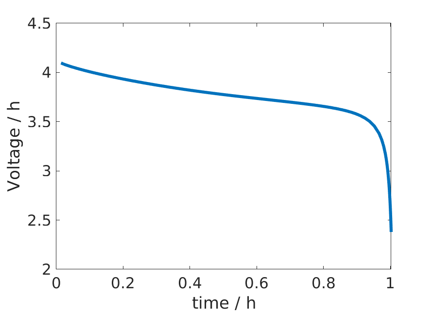
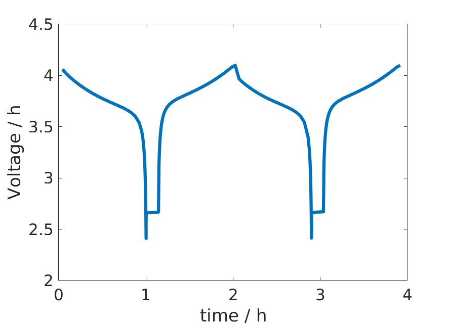
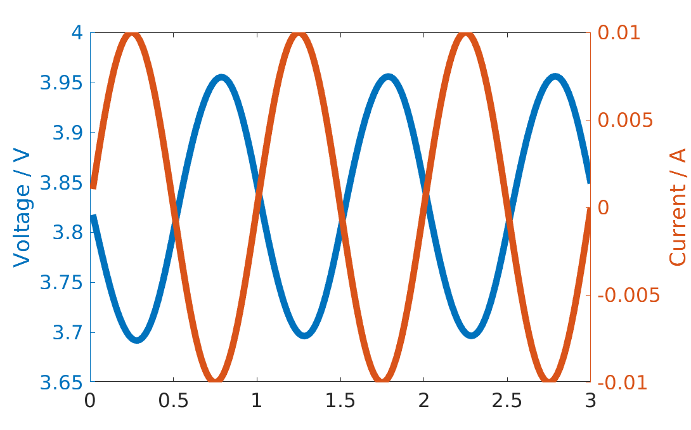

==============
Control models
==============

The battery :battmo:`model <Battery#19>` contains a *Control* sub-model, see the overall model structure
:ref:`description<architecture:BattMo Model Architecture>`. The Control model determine the control *values* and *type*.

At a **given time**, there are in general two control types:

* Total current
* Voltage  

Given a control type, the control *value* can change in time. For the most standard control types, the json interface
can be used. We plan to include there more control models. Below, we give some short explanations on how a control model
can be implemented.

Json input control interface
============================

The most standard controls can be called from BattMo using the json interface:

* Constant Current Discharge (CCDischarge)
* Constant Current Charge (CCCharge)
* Constant Current Constant Voltage (CCCV)

The parameters for each of the model are described in the json schema :battmofile:`ControlModel.schema.json
<Utilities/JsonSchemas/ControlModel.schema.json>`. Let us review them by looking at examples. For all controls, we have
a given :code:`CRate`. The property :code:`controlPolicy` is used to set the control model.

**Constant Current Discharge**

Before the simulation starts, the capacity of the battery is computed. The battery capacity value is used to compute the
given input current from the CRate value. For a constant current discharge, we have a lower cutoff voltage where the
simulation stops.  The parameter :code:`useCVswitch` can be used if we want to continue the simulation until a given
fixed time, by switching to voltage control. At the start of the simulation, strong non-linearities in the equations may
create difficulties to reach the activation potential. For this reason, there is the possibility to use a *rampup time*
where the current is gradually increased from zero to the targeted given input current. 

.. code:: json

   "Control": {
    "controlPolicy": "CCDischarge",
    "rampupTime": 0.1,
    "CRate": 1,
    "lowerCutoffVoltage": 2.4
  }

For the dataset given :battmofile:`here
<ParameterData/BatteryCellParameters/LithiumIonBatteryCell/lithium_ion_battery_nmc_graphite.json>`, we obtain the
following result.

   Constant Current Discharge control
      
**Constant Current Charge**

In the same way as the discharge case, the capacity of the battery is computed first to set the given input current from
the CRate. When the upper cuttoff voltage limit is reached, the control type is switched to voltage control. Also in
this case, we can include a rampup time. As an example,

.. code:: json

   "Control": {
    "controlPolicy": "CCCharge",
    "rampupTime": 0.1,
    "CRate": 1,
    "upperCutoffVoltage": 4.1,
  }

For the dataset given :battmofile:`here
<ParameterData/BatteryCellParameters/LithiumIonBatteryCell/lithium_ion_battery_nmc_graphite.json>`, we obtain the
following result.

.. figure:: img/controlExampleCCCharge.png
   :target: _images/controlExampleCCCharge.png
   :width: 70%
   :align: center

   Constant Current Charge control

**Constant Current Constant Charge**

An example of input is

.. code:: json

   "Control": {
    "controlPolicy": "CCCV",
    "CRate": 1,
    "initialControl": "discharging",
    "numberOfCycles": 2,
    "lowerCutoffVoltage": 2.4,
    "upperCutoffVoltage": 4.1,
    "dIdtLimit": 1e-5,
    "dEdtLimit": 1e-5
  },

The control type and value are set following the following procedure. In the case above, we start by discharging

1. We use a constant discharge current computed from the capacity and the given CRate. We keep this value until the
   lower cutoff voltage value is reached. Then, we switch to step 2.
2. The control is set to zero. At each time step we compute the time derivative of the voltage
   :math:`\frac{dE}{dt}`. When this value reach the limit given by :code:`dEdtLimit`. We start the charge step 3.
3. We use a constant charge current. The value is the same as in step 1, with opposite sign. We keep this current until
   the lower cutoff voltage limit is reached. Then we switch to constant voltage control step 4.
4. We use a constant voltage given by the cutoff value and monitor the current derivative :math:`\frac{dI}{dt}`. When
   this value is lower than :code:`dIdtLimit`, we start again the discharge by going to step 1.

We iterate this process for the given number of cycles. For the dataset given :battmofile:`here
<ParameterData/BatteryCellParameters/LithiumIonBatteryCell/lithium_ion_battery_nmc_graphite.json>`, we obtain the
following result.

   CCCV control

The script used to generate the figures is available :battmofile:`here <Documentation/scripts/plotControlExamples.m>`.

Control model description
=========================

The most fundamental structure to setup control is a schedule structure, which is sent to :mrstfile:`simulateScheduleAD
<autodiff/ad-core/simulators/simulateScheduleAD.m>`. From there, we find the specification of the :code:`schedule`
structure that is expected. It contains two fields:

* :code:`control`: It is a struct array containing fields that the model knows how to process.  Typically, this
  will be the fields such as `src` for input current.
* :code:`step`: It contains two arrays of equal size named :code:`val` and :code:`control`. Control is a index into the
  :code:`schedule.control` array, indicating which control is to be used for the timestep.`schedule.step.val` is the
  timestep used for that control step.

Let us set up a control with a given current control source function.

.. code:: matlab

   dt = 1*second;
   T  = 3*minute;
   N  = T/dt;

   step.val = dt*ones(N, 1);
   step.control = ones(N, 1);

   period = 1*minute;
   control.src = @(time) (1e-2*ampere*sin(2*pi*time/period));
   control.CC = true;

   schedule.step = step;
   schedule.control = control;

We have to setup a model and an initial state. We use the function :battmo:`setupModelFromJson` to setup the model from
a given json input. We load our sample input function, see source
:battmofile:`here<Examples/jsondatafiles/sample_input.json>`. We replace the :code:`Control` field with a structure with
a :code:`controlPolicy` given by a control current. The control model used here will then be :battmo:`ControlModel`. We
change the initial state of charge value so that we do not hit the upper current voltage value (the one given in the
sample json is 0.99).

.. code:: matlab

   jsonstruct = parseBattmoJson('Examples/jsondatafiles/sample_input.json');

   jsonstruct.Control = [];
   jsonstruct.Control.controlPolicy = 'CC';

   jsonstruct.SOC = 0.5;

   model = setupModelFromJson(jsonstruct);

We use the default state initialisation method given by the method :code:`setupInitialState` in the :battmo:`Battery` model.

.. code:: matlab

   initstate = model.setupInitialState(jsonstruct);

Now, we can run the simulation for the given schedule, model and initial state using :mrstfile:`simulateScheduleAD
<autodiff/ad-core/simulators/simulateScheduleAD.m>`

   
