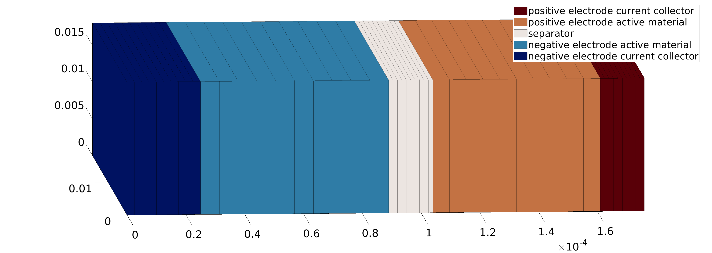
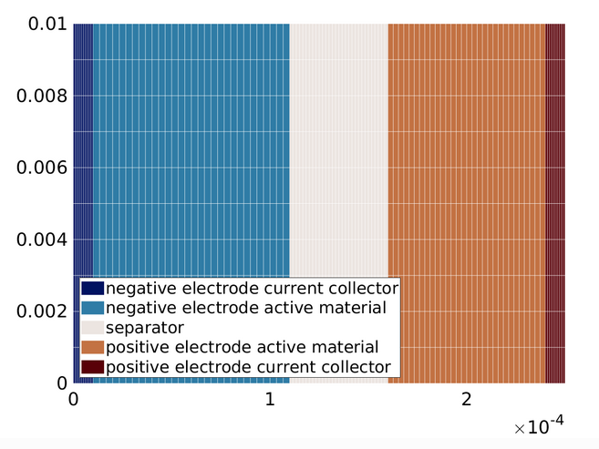
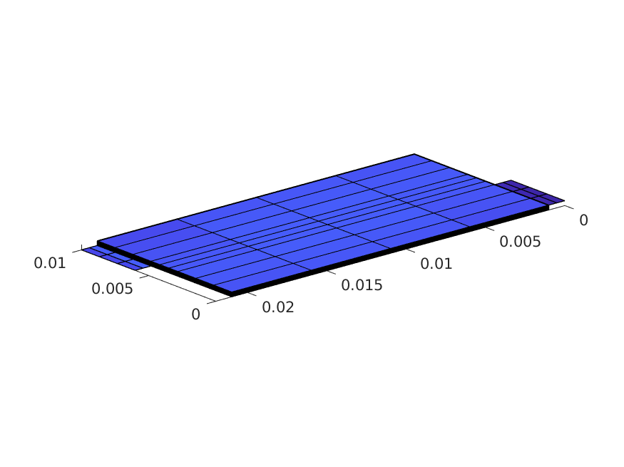
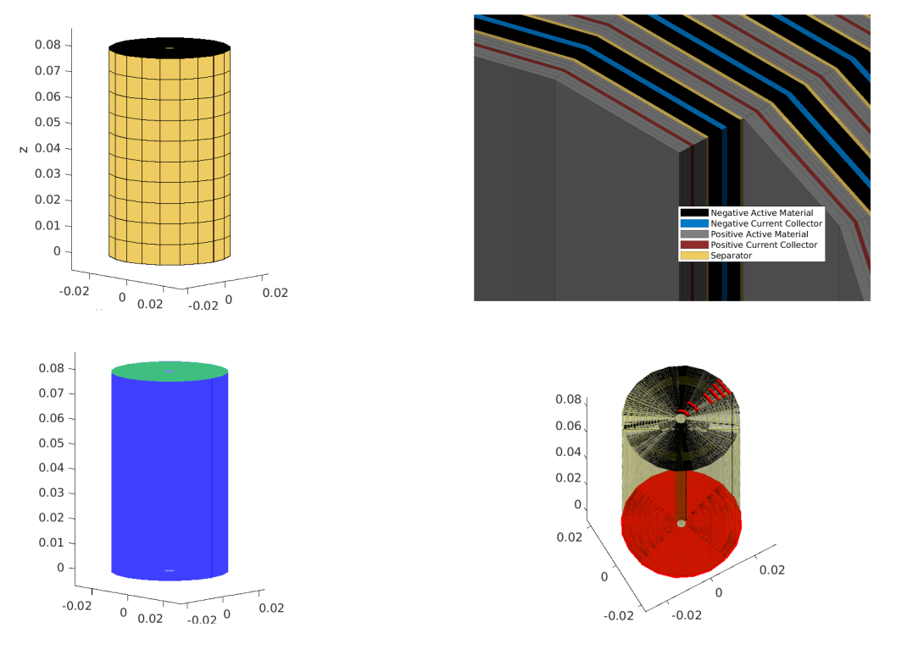
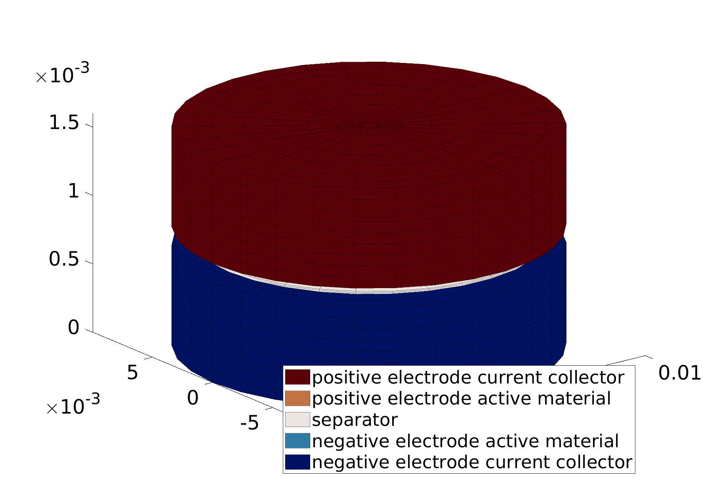

==================
Battery Geometries
==================

.. module:: Battery.BatteryGeometry

Description of the models that are used to setup the geometry

BatteryGenerator1D
------------------

                   
.. class:: BatteryGenerator1D
      
.. _2dgeometry:
         
BatteryGenerator2D
------------------

                   
.. class:: BatteryGenerator2D
         
.. _3dgeometry:
      
BatteryGenerator3D
------------------

                   
.. class:: BatteryGenerator3D

.. _jellyroll:
      
SpiralBatteryGenerator
----------------------

                   
.. class:: SpiralBatteryGenerator

.. _coincell:
      
CoinCellBatteryGenerator
------------------------

                   
.. class:: CoinCellBatteryGenerator
      
         
BlockBatteryGenerator
---------------------

not yet documented
         
CoinCellSectorBatteryGenerator
------------------------------

not yet documented

         
FlatBatteryGenerator
--------------------

not yet documented

         
SectorBatteryGenerator
----------------------

not yet documented

         
Base class
----------

This is the base class that gather the methods to setup the different grid. This class will be usefull if you want to
setup your own tailored grid.

.. class:: BatteryGenerator
         
