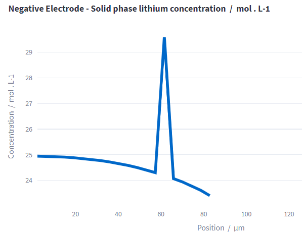

===================
Troubleshooting
===================

This sections gives some troubleshooting ideas.

Unnatural artifacts in your results
====================================

A spike like this in your results indicates a discritization issue. In order to fix the issue you can increase the number of cells used in the simulation.
As in the example, the artifact is visible in the results of the negative electrode, the number of electrode cells of the negative electrode should be increased until the issue is resolved.
The 'number of cells' parameters can be found among the 'advanced' input parameters.

.. Unsuccesful simulation
.. ======================