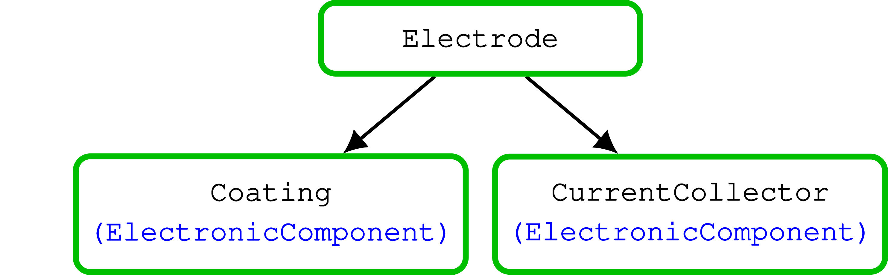
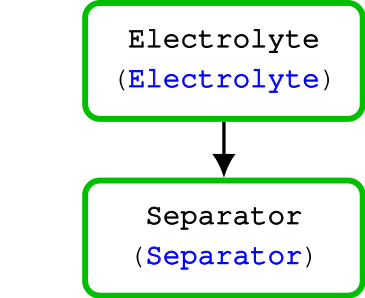
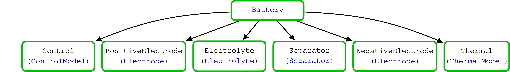

================
Input Parameters
================

We need to propagate inputs in each of submodels. To do that we use a hierarchy of input classes that is sent
recursively to the models. The input class is named accordingly to the model it corresponds to and its source is located
in the same folder.

Input parameters for the electrode components
=============================================

An electrode (:class:`Electrode <Electrochemistry.Electrode>`) consists of an active material (:class:`ActiveMaterial
<Electrochemistry.ActiveMaterial>`), which contains an interface model (:class:`Interface <Electrochemistry.Interface>`)
and a solid diffusion model (:class:`SolidDiffusionModel <Electrochemistry.SolidDiffusionModel>`), and a current
collector (:class:`CurrentCollector <Electrochemistry.CurrentCollector>`)

Input parameter for Electrode
-----------------------------

.. autoclass:: Electrochemistry.ElectrodeInputParams
   :members:

      
Input parameter for Active Material
-----------------------------------

.. autoclass:: Electrochemistry.ActiveMaterialInputParams
   :members:

            
Input parameter for Interface
-----------------------------

.. autoclass:: Electrochemistry.InterfaceInputParams
   :members:

      
Input parameter for Solid Diffusion Model
-----------------------------------------

.. autoclass:: Electrochemistry.SolidDiffusionModelInputParams
   :members:

      
Input parameter for Current Collector
-------------------------------------
      
.. autoclass:: Electrochemistry.CurrentCollectorInputParams
   :members:

Input parameters for the Electrolyte components
===============================================

                   
.. autoclass:: Electrochemistry.ElectrolyteInputParams
   :members:
.. autoclass:: Electrochemistry.SeparatorInputParams
   :members:
   
Input parameters for the Battery
================================

.. autoclass:: Battery.BatteryInputParams
   :members:

