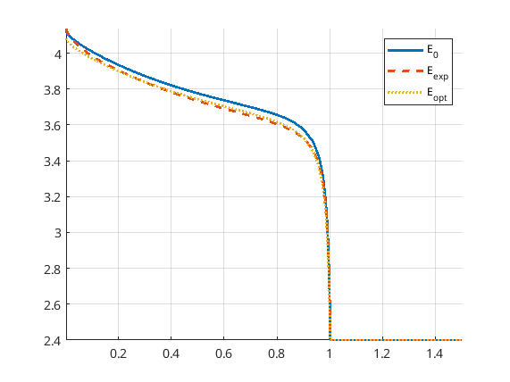

============
Optimization
============

The topic of optimization does not only involve finding the parameters
that maximises some output quantity such as the energy
output. Optimization, from a mathematical viewpoint, also involve
fitting parameters in the numerical model against data, for
example provided by experiments. This procedure has many names,
including "fitting", "parameterisation", "calibration" and "parameter
identification". Here we use the latter. We will here present an
example of parameter identification followed by an example of
optimization.

Parameter identification example
================================

The complete source code of this example can be found at
:battmofile:`runParameterIdentification<Examples/Optimisation/runParameterIdentification.m>`.

As often, we start by defining our MRST modules (in particular
`optimization`) and some convenient short names.

.. code:: matlab

	  mrstModule add ad-core optimization mpfa mrst-gui

	  clear
	  close all

	  ne      = 'NegativeElectrode';
	  pe      = 'PositiveElectrode';
	  elyte   = 'Electrolyte';
	  thermal = 'ThermalModel';
	  am      = 'ActiveMaterial';
	  co      = 'Coating';
	  itf     = 'Interface';
	  sd      = 'SolidDiffusion';
	  ctrl    = 'Control';
	  sep     = 'Separator';

Then we set up the battery: the chemistry, the geometry, how it is
operated (the control) and the time stepping. Here, an option for
validating the json struct is included but set to false by default
since the validation requires MATLAB to call Python, which in turn requires a compatible Python version installed.

Also, there is commented code for setting up a finer time
discretization. This is because later in the tutorial we will see the
effect of using a finer time discretization and stricter tolerances.

.. code:: matlab

	  jsonParams  = parseBattmoJson(fullfile('ParameterData', 'BatteryCellParameters', 'LithiumIonBatteryCell', 'lithium_ion_battery_nmc_graphite.json'));
	  jsonGeom    = parseBattmoJson(fullfile('Examples', 'JsonDataFiles', 'geometry1d.json'));
	  jsonControl = parseBattmoJson(fullfile('Examples', 'JsonDataFiles', 'cc_discharge_control.json'));
	  jsonSim     = parseBattmoJson(fullfile('Examples', 'JsonDataFiles', 'simulation_parameters.json'));

	  json = mergeJsonStructs({jsonParams, jsonGeom, jsonControl, jsonSim});

	  json.Control.useCVswitch = true;

	  % % Test finer time discretization
	  % json.TimeStepping.numberOfTimeSteps = 80;
	  % json.TimeStepping.numberOfRampupSteps = 10;

	  % Optionally validate the json struct
	  validateJson = false;

The json struct completely specifies the simulation. We simulate the
model and save the output in a conventient data structure. This will
form the initial data for the parameter identification later on.

.. code:: matlab

	  json0 = json;
	  output0 = runBatteryJson(json0, 'validateJson', validateJson);

	  simSetup = struct('model'   , output0.model   , ...
			    'schedule', output0.schedule, ...
			    'state0'  , output0.initstate);

In this example we will fit five parameters:

* the Bruggeman coefficient for the electrolyte
* the exchange current densities for both electrodes
* the volumetric surface areas for both electrodes

To set up these parameters in the fitting, we use the `ModelParameter`
class in MRST. As can be seen in the source code found at
:battmofile:`ModelParameter<Externals/mrst/mrst-autodiff/optimization/utils/ModelParameter.m>`,
there are a several options that can be set. The most important ones are the ones used here:

* the name of the parameter (arbitrary)
* the object to which the parameter belongs (usually model)
* the `boxLims`, which sets hard constraints for the range of the parameters
* the scaling, which is linear per default, but may be logarithmic
* the location of the parameter in the object (model)

.. code:: matlab

	  params = addParameter(params, simSetup, ...
		      'name', 'elyte_bruggeman', ...
		      'belongsTo', 'model', ...
		      'boxLims', [1, 3], ...
		      'location', {elyte, 'bruggemanCoefficient'});

	  % Exchange current densities in the Butler-Volmer eqn
	  params = addParameter(params, simSetup, ...
				'name', 'ne_k0', ...
				'belongsTo', 'model', ...
				'scaling', 'log', ...
				'boxLims', [1e-12, 1e-9], ...
				'location', {ne, co, am, itf, 'reactionRateConstant'});
	  params = addParameter(params, simSetup, ...
				'name', 'pe_k0', ...
				'belongsTo', 'model', ...
				'scaling', 'log', ...
				'boxLims', [1e-12, 1e-9], ...
				'location', {pe, co, am, itf, 'reactionRateConstant'});

	  % Volumetric surface areas
	  params = addParameter(params, simSetup, ...
				'name', 'ne_vsa', ...
				'belongsTo', 'model', ...
				'boxLims', [1e5, 1e7], ...
				'location', {ne, co, am, itf, 'volumetricSurfaceArea'});
	  params = addParameter(params, simSetup, ...
				'name', 'pe_vsa', ...
				'belongsTo', 'model', ...
				'boxLims', [1e5, 1e7], ...
				'location', {pe, co, am, itf, 'volumetricSurfaceArea'});

In the next step we generate what we denote "experimental" data that
we will calibrate against. This is done by running a simulation with
values of the parameters in `params` to be mean values of the
`boxLims`. This makes the resulting optimization problem very easy to
solve, but still illustrates the basic workflow of setting up
parameter identification problems.

.. code:: matlab

	  jsonExp = json;
	  pExp = zeros(numel(params), 1);
	  for ip = 1:numel(params)
	    loc = params{ip}.location;
	    orig = params{ip}.getfun(simSetup.(params{ip}.belongsTo), loc{:});
	    new = mean(params{ip}.boxLims);
	    jsonExp = params{ip}.setfun(jsonExp, loc{:}, new);
	    pExp(ip) = new;
	  end
	  outputExp = runBatteryJson(jsonExp, 'validateJson', validateJson);

Next we set up the objective function, i.e. the function we seek to
minimize by varying the parameters `params`. We set this to be a least
squares function of the differences of the "experimental" values and
the values that will be obtained during the optimization. The least
squares function here is actually formed by both the voltages and the
currents, but the currents in this model are fixed.

To make sure the objective function is correct, we test it by
evaluating it using the generated "experimental" values to make sure
it is zero.

Physics-based models are costly to simulate accurately, because they
are nonlinear and large. Since multiple evaluations of the model must
likely be done during optimization, we want an algorithm that is as
efficient as possible in this sense, taking into information of
gradients. The function that will compute the gradients of the
objective function with respect to `params` is also set up here. Under
the hood, :battmo: will compute these by solving the adjoint problem.

.. code:: matlab

	  % Objective function
	  objective = @(model, states, schedule, varargin) leastSquaresEI(model, states, outputExp.states, schedule, varargin{:});

	  % Debug: the objective function evaluated at the experimental values
	  % should be zero
	  objval = objective(outputExp.model, outputExp.states, outputExp.schedule);
	  assert(max(abs([objval{:}])) == 0.0);

	  % Function for gradient computation
	  objVals = objective(output0.model, output0.states, output0.schedule);
	  objScaling = sum([objVals{:}]);
	  objectiveGradient = @(p) evalObjectiveBattmo(p, objective, simSetup, params, 'objScaling', objScaling);

To make sure the adjoint gradients are correct, we can compare them
with gradients calculated by a classical finite difference
approximation. The relative difference between them should not be too
large, and it can also be useful to simply look at the sign. This is
such a basal check that during development, the commented `return`
statement below can be uncommented until the objective function is
correctly set up.

.. code:: matlab

	  debug = true;
	  if debug
	    pTmp = getScaledParameterVector(simSetup, params);

	    [vad, gad] = evalObjectiveBattmo(pTmp, objective, simSetup, params, ...
					     'gradientMethod', 'AdjointAD');

	    [vnum, gnum] = evalObjectiveBattmo(pTmp, objective, simSetup, params, ...
					 'gradientMethod', 'PerturbationADNUM', ...
					 'PerturbationSize', 1e-7);
	    fprintf('Adjoint and finite difference derivatives and the relative error\n');
	    disp([gad, gnum, abs(gad-gnum)./abs(gad)])

	    %return
	  end

Now we are ready to perform the optimization. We use a well-tested,
efficient BFGS method with the parameters set by `params`. The initial
guess is deduced from the `belongsTo` and `location` properties in the
`params` vector. Note that the parameters are actually scaled to `[0,
1]` using the `boxLims`. After the optimization, these will be scaled
back.

We may set up several criteria for the BFGS method to terminate:

* `gradTol`: BFGS terminates if the gradient is less than this value.
* `objChangeTol`: BFGS terminates if the change in the objective function is less than this value.
* `maxIt`: BFGS terminates after these many iterations.

Also note that we set `maximize=false`, since we perform a
minimization: we want to minimize the least squares functional.

Note that we have commented out a stricter value for
`objChangeTol`. It is of great interest to see how using this value in
combination with the finer temporal discretization will change the
result. In fact, numerous numerical properties may influence the
optimization. Not only the parameters of the BFGS method, but also the
space and time discretization parameters and solver tolerances also
may play a role.

.. code:: matlab

	  p0scaled = getScaledParameterVector(simSetup, params);
	  gradTol = 1e-7;
	  objChangeTol = 1e-4;
	  %objChangeTol = 1e-7;
	  maxIt = 25;
	  [v, pOptTmp, history] = unitBoxBFGS(p0scaled      , objectiveGradient, ...
					      'maximize'    , false            , ...
					      'gradTol'     , gradTol          , ...
					      'objChangeTol', objChangeTol     , ...
					      'maxIt'       , maxIt            , ...
					      'logplot'     , true);
	  numIt = numel(history.val);

After waiting for BFGS to finish (a couple of minutes on a standard
laptop), we run the model with the optimized parameters, optionally
plot the result and display the relative difference between the
"experimental", and optimized values.

.. code:: matlab

	  jsonOpt = json;

	  for ip = 1:numel(params)
	      loc = params{ip}.location;
	      jsonOpt = params{ip}.setfun(jsonOpt, loc{:}, pOpt(ip));
	  end

	  outputOpt = runBatteryJson(jsonOpt, 'validateJson', validateJson);

	  %%
	  do_plot = true;
	  if do_plot
	      set(0, 'defaultlinelinewidth', 2)

	      getTime = @(states) cellfun(@(state) state.time, states);
	      getE = @(states) cellfun(@(state) state.Control.E, states);

	      t0 = getTime(output0.states);
	      E0 = getE(output0.states);
	      tOpt = getTime(outputOpt.states);
	      EOpt = getE(outputOpt.states);
	      tExp = getTime(outputExp.states);
	      EExp = getE(outputExp.states);

	      h = figure; hold on; grid on; axis tight
	      plot(t0/hour, E0, 'displayname', 'E_{0}')
	      plot(tExp/hour, EExp, '--', 'displayname', 'E_{exp}');
	      plot(tOpt/hour, EOpt, ':', 'displayname', 'E_{opt}')
	      legend;

	  end

	  %% Summarize
	  pOrig = cellfun(@(p) p.getParameter(simSetup), params)';

	  fprintf('Initial guess:\n');
	  fprintf('%g\n', pOrig);

	  fprintf('Fitted values (* means we hit the box limit):\n');
	  tol = 1e-3;
	  for k = 1:numel(params)
	      hit = '';
	      if abs(pOptTmp(k)) < tol || abs(pOptTmp(k)-1) < tol
		  hit = '*';
	      end
	      fprintf('%g %s\n', pOpt(k), hit);
	  end

	  fprintf('\nExperimental values:\n');
	  fprintf('%g\n', pExp);

	  fprintf('\nRelative error between optimized and experimental values:\n')
	  fprintf('%g\n', relErr);

	  fprintf('\nIterations:\n')
	  fprintf('%g\n', numIt);

The match of the discharge voltage using the default setup is shown in
the figure below. It's good towards the end, but not so much in the
beginning. Here

* E_0 is the voltage using the parameters from the initial guess
* E_exp is the "experimental" voltage that we seek to match
* E_opt is the voltage from the optimized parameters

Now we can uncomment the parts of the code that give a finer time
discretization and a stricter tolerance for BFGS as discussed
above. Running the program again results in a very good match.

..  figure:: img/runParameterIdentification2.png
    :target: _images/runParameterIdentification2.png
    :width: 100%
    :align: center

Optimization example
====================

In progress.
