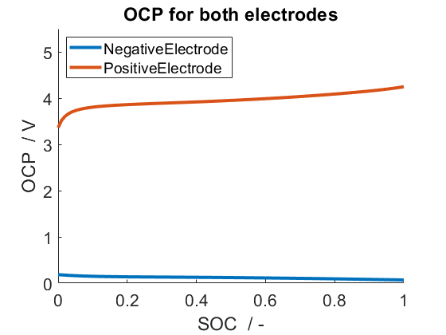
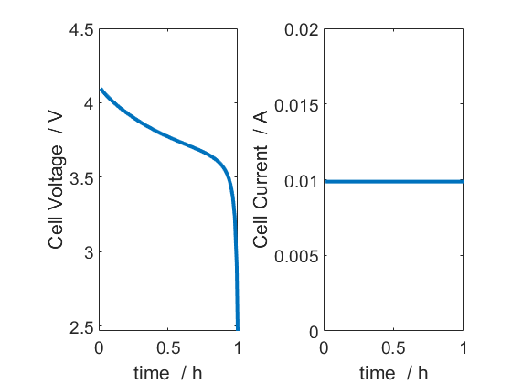

.. _battMoTutorial:

BattMo Tutorial
------------------------------------
*Generated from battMoTutorial.m*

This tutorial explains how to setup and run a simulation in BattMo

.. code-block:: matlab

  % First clear variables stored in memory and close all figures
  clear;
  close all;
  
  % Set thicker line widths and larger font sizes
  set(0, 'defaultLineLineWidth', 3);
  set(0, 'defaultAxesFontSize', 16);
  set(0, 'defaultTextFontSize', 18);

Setting up the environment
^^^^^^^^^^^^^^^^^^^^^^^^^^
BattMo uses functionality from :mod:`MRST <MRSTBattMo>`. This functionality is collected into modules where each module contains code for doing specific things. To use this functionality we must add these modules to the matlab path by running:

.. code-block:: matlab

  mrstModule add ad-core mrst-gui mpfa agmg linearsolvers

Specifying the physical model
^^^^^^^^^^^^^^^^^^^^^^^^^^^^^
In this tutorial we will simulate a lithium-ion battery consisting of a negative electrode, a positive electrode and an electrolyte. BattMo comes with some pre-defined models which can be loaded from JSON files. Here we will load the basic lithium-ion model JSON file which comes with Battmo. We use :battmo:`parseBattmoJson` to parse the file, see :todo:`add link to doc`

.. code-block:: matlab

  fname = fullfile('ParameterData','BatteryCellParameters',...
                   'LithiumIonBatteryCell','lithium_ion_battery_nmc_graphite.json');
  jsonstruct = parseBattmoJson(fname);

The parseBattmoJson function parses the JSON input and creates a matlab structure containing the same fields as the JSON input. This structure can be changed to setup the model in the way that we want.
In this instance we will exclude temperature effects by setting use_thermal to false.

.. code-block:: matlab

  jsonstruct.use_thermal = false;

We will also not use current collectors in this example:

.. code-block:: matlab

  jsonstruct.include_current_collectors = false;

The structure created in the jsonstruct follows the same hierarchy as the fields in the JSON input file. These can be referenced by name in the jsonstruct. To make life easier for ourselves we define some shorthand names for various parts of the structure.

.. code-block:: matlab

  ne      = 'NegativeElectrode';
  pe      = 'PositiveElectrode';
  elyte   = 'Electrolyte';
  thermal = 'ThermalModel';
  co      = 'Coating';
  am      = 'ActiveMaterial';
  itf     = 'Interface';
  sd      = 'SolidDiffusion';
  ctrl    = 'Control';
  cc      = 'CurrentCollector';

Now we can set the diffusion model type for the active material (am) in the positive (pe) and negative (ne) electrodes to 'full'.

.. code-block:: matlab

  jsonstruct.(pe).(am).diffusionModelType = 'full';
  jsonstruct.(ne).(am).diffusionModelType = 'full';

To see which other types of diffusion model are available one can view :battmo:`ActiveMaterialInputParams`.  When running a simulation, BattMo requires that all model parameters are stored in an instance of :battmo:`BatteryInputParams`. This class is used to initialize the simulation and is accessed by various parts of the simulator during the simulation. This class is instantiated using the jsonstruct we just created:

.. code-block:: matlab

  inputparams = BatteryInputParams(jsonstruct);

It is also possible to update the properties of this inputparams in a similar way to updating the jsonstruct. Here we set the discretisation level for the diffusion model. Other input parameters for the full diffusion model can be found here: :battmo:`FullSolidDiffusionModelInputParams`.

.. code-block:: matlab

  inputparams.(ne).(co).(am).(sd).N = 5;
  inputparams.(pe).(co).(am).(sd).N = 5;
  
  % We can also change how the battery is operated, for example setting
  % the cut off voltage.
  inputparams.(ctrl).lowerCutoffVoltage = 2.5;

Setting up the geometry
^^^^^^^^^^^^^^^^^^^^^^^
Here, we setup the 1D computational grid that will be used for the simulation. The required discretization parameters are already included in the class :battmo:`BatteryGeneratorP2D`. Classes for generating other geometries can be found in the BattMo/Battery/BatteryGeometry folder.

.. code-block:: matlab

  gen = BatteryGeneratorP2D();

Now, we update the inputparams with the properties of the grid. This function will update relevent parameters in the inputparams object and make sure we have all the required parameters for the model geometry chosen.

.. code-block:: matlab

  inputparams = gen.updateBatteryInputParams(inputparams);

Initialising the battery model object
^^^^^^^^^^^^^^^^^^^^^^^^^^^^^^^^^^^^^
The battery model is initialized by sending inputparams to the Battery class constructor. see :battmo:`Battery`.
In BattMo a battery model is actually a collection of submodels: Electrolyte, Negative Electrode, Positive Electrode, Thermal Model and Control Model. The battery class contains all of these submodels and various other parameters necessary to run the simulation.

.. code-block:: matlab

  model = Battery(inputparams);

Plotting the OCP curves against state of charge
^^^^^^^^^^^^^^^^^^^^^^^^^^^^^^^^^^^^^^^^^^^^^^^
We can inspect the model object to find out which parameters are being used. For instance the information we need to plot the OCP curves for the positive and negative electrodes can be found in the interface structure of each electrode.

.. code-block:: matlab

  T = 298.15;
  eldes = {ne, pe};
  
  figure
  hold on
  
  for ielde = 1:numel(eldes)
      el_itf = model.(eldes{ielde}).(co).(am).(itf);
  
      theta100 = el_itf.guestStoichiometry100;
      theta0   = el_itf.guestStoichiometry0;
      cmax     = el_itf.saturationConcentration;
  
      soc   = linspace(0, 1);
      theta = soc*theta100 + (1 - soc)*theta0;
      c     = theta.*cmax;
      OCP   = el_itf.computeOCPFunc(c, T, cmax);
  
      plot(soc, OCP)
  end
  
  xlabel('SOC  / -')
  ylabel('OCP  / V')
  title('OCP for both electrodes');
  ylim([0, 5.5])
  legend(eldes, 'location', 'nw')

Controlling the simulation
^^^^^^^^^^^^^^^^^^^^^^^^^^
The control model specifies how the battery is operated, i.e., how the simulation is controlled.
In the first instance we use CCDischarge control policy. We set the total time scaled by the CRate in the model. The CRate has been set by the json file. We can access it here:

.. code-block:: matlab

  CRate = model.Control.CRate;
  total = 1.1*hour/CRate;

We want to break this total time into 100 timesteps. To begin with we will use equal values for each timestep.
We create a structure containing the length of each step in seconds ('val') and also which control to use for each step ('control').
In this case we use control 1 for all steps. This means that the functions used to setup the control values are the same at each step.

.. code-block:: matlab

  n  = 100;
  dt = total/n;
  step = struct('val', dt*ones(n, 1), 'control', ones(n, 1));

We create a control structure containing the source function and and a stopping criteria. The control parameters have been given in the json file :battmofile:`ParameterData/BatteryCellParameters/LithiumIonBatteryCell/lithium_ion_battery_nmc_graphite.json`
The :code:`setupScheduleControl` method contains the code to setup the control structure that is used in the schedule structure setup below.

.. code-block:: matlab

  control = model.Control.setupScheduleControl();

Finally we collect the control and step structures together in a schedule struct which is the schedule which the simulation will follow:

.. code-block:: matlab

  schedule = struct('control', control, 'step', step);

Setting the initial state of the battery
^^^^^^^^^^^^^^^^^^^^^^^^^^^^^^^^^^^^^^^^
To run simulation we need to know the starting point which we will run it from, in terms of the value of the primary variables being modelled at the start of the simulation. The initial state of the model is setup using model.setupInitialState() Here we take the state of charge (SOC) given in the input and calculate equilibrium concentration based on theta0, theta100 and cmax.

.. code-block:: matlab

  initstate = model.setupInitialState();

Running the simulation
^^^^^^^^^^^^^^^^^^^^^^
Once we have the initial state, the model and the schedule, we can call the simulateScheduleAD function which will actually run the simulation.
The outputs from the simulation are: - sols: which provides the current and voltage of the battery at each   timestep. - states: which contains the values of the primary variables in the model   at each timestep. - reports: which contains technical information about the steps used in   the numerical solvers.

.. code-block:: matlab

  [sols, states, report] = simulateScheduleAD(initstate, model, schedule);

Plotting the results
^^^^^^^^^^^^^^^^^^^^
To get the results we use the matlab cellfun function to extract the values Control.E, Control.I and time from each timestep (cell in the cell array) in states. We can then plot the vectors.

.. code-block:: matlab

  E = cellfun(@(x) x.Control.E, states);
  I = cellfun(@(x) x.Control.I, states);
  time = cellfun(@(x) x.time, states);
  
  figure()
  
  subplot(1,2,1)
  plot(time/hour, E)
  xlabel('time  / h')
  ylabel('Cell Voltage  / V')
  
  subplot(1,2,2)
  plot(time/hour, I)
  ylim([0, 0.02])
  xlabel('time  / h')
  ylabel('Cell Current  / A')

complete source code can be found :ref:`here<battMoTutorial_source>`
