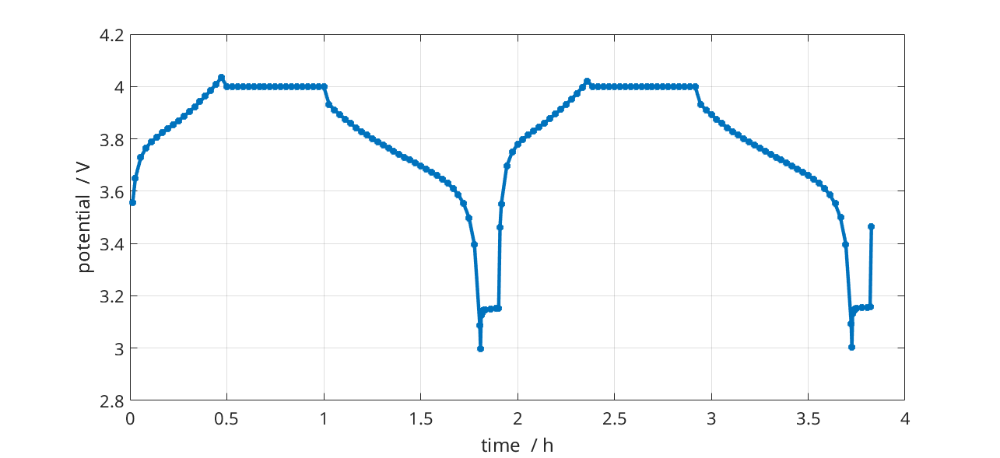

.. _runBatteryP2D:

Pseudo-Two-Dimensional (P2D) Lithium-Ion Battery Model
--------------------------------------------------------------------------
*Generated from runBatteryP2D.m*

This example demonstrates how to setup a P2D model of a Li-ion battery and run a simple simulation.

.. code-block:: matlab

  % Clear the workspace and close open figures
  clear
  close all

Import the required modules from MRST
^^^^^^^^^^^^^^^^^^^^^^^^^^^^^^^^^^^^^
load MRST modules

.. code-block:: matlab

  mrstModule add ad-core mrst-gui mpfa agmg linearsolvers

Setup the properties of Li-ion battery materials and cell design
^^^^^^^^^^^^^^^^^^^^^^^^^^^^^^^^^^^^^^^^^^^^^^^^^^^^^^^^^^^^^^^^
The properties and parameters of the battery cell, including the architecture and materials, are set using an instance of :class:`BatteryInputParams <Battery.BatteryInputParams>`. This class is used to initialize the simulation and it propagates all the parameters throughout the submodels. The input parameters can be set manually or provided in json format. All the parameters for the model are stored in the inputparams object.

.. code-block:: matlab

  jsonstruct = parseBattmoJson(fullfile('ParameterData','BatteryCellParameters','LithiumIonBatteryCell','lithium_ion_battery_nmc_graphite.json'));
  
  % We define some shorthand names for simplicity.
  ne      = 'NegativeElectrode';
  pe      = 'PositiveElectrode';
  elyte   = 'Electrolyte';
  thermal = 'ThermalModel';
  co      = 'Coating';
  am      = 'ActiveMaterial';
  itf     = 'Interface';
  sd      = 'SolidDiffusion';
  ctrl    = 'Control';
  cc      = 'CurrentCollector';
  
  jsonstruct.use_thermal = false;
  jsonstruct.include_current_collectors = false;
  
  inputparams = BatteryInputParams(jsonstruct);
  
  use_cccv = false;
  if use_cccv
      cccvstruct = struct( 'controlPolicy'     , 'CCCV',  ...
                           'initialControl'    , 'discharging', ...
                           'CRate'             , 1         , ...
                           'lowerCutoffVoltage', 2.4       , ...
                           'upperCutoffVoltage', 4.1       , ...
                           'dIdtLimit'         , 0.01      , ...
                           'dEdtLimit'         , 0.01);
      cccvparamobj = CcCvControlModelInputParams(cccvstruct);
      inputparams.Control = cccvinputparams;
  end

Setup the geometry and computational grid
^^^^^^^^^^^^^^^^^^^^^^^^^^^^^^^^^^^^^^^^^
Here, we setup the 1D computational grid that will be used for the simulation. The required discretization parameters are already included in the class BatteryGeneratorP2D.

.. code-block:: matlab

  gen = BatteryGeneratorP2D();
  
  % Now, we update the inputparams with the properties of the grid.
  inputparams = gen.updateBatteryInputParams(inputparams);

Initialize the battery model.
^^^^^^^^^^^^^^^^^^^^^^^^^^^^^
The battery model is initialized by sending inputparams to the Battery class constructor. see :class:`Battery <Battery.Battery>`.

.. code-block:: matlab

  model = Battery(inputparams);
  
  model.AutoDiffBackend= AutoDiffBackend();
  
  inspectgraph = false;
  if inspectgraph
      cgt = model.computationalGraph;
      return
  end

Compute the nominal cell capacity and choose a C-Rate
^^^^^^^^^^^^^^^^^^^^^^^^^^^^^^^^^^^^^^^^^^^^^^^^^^^^^
The nominal capacity of the cell is calculated from the active materials. This value is then combined with the user-defined C-Rate to set the cell operational current.

.. code-block:: matlab

  CRate = model.Control.CRate;

Setup the time step schedule
^^^^^^^^^^^^^^^^^^^^^^^^^^^^
Smaller time steps are used to ramp up the current from zero to its operational value. Larger time steps are then used for the normal operation.

.. code-block:: matlab

  switch model.(ctrl).controlPolicy
    case 'CCCV'
      total = 3.5*hour/CRate;
    case 'CCDischarge'
      total = 1.4*hour/CRate;
    otherwise
      error('control policy not recognized');
  end
  
  n  = 100;
  dt = total/n;
  step = struct('val', dt*ones(n, 1), 'control', ones(n, 1));
  
  % we setup the control by assigning a source and stop function.
  
  control = model.Control.setupScheduleControl();
  
  % This control is used to set up the schedule
  schedule = struct('control', control, 'step', step);

Setup the initial state of the model
^^^^^^^^^^^^^^^^^^^^^^^^^^^^^^^^^^^^
The initial state of the model is setup using the model.setupInitialState() method.

.. code-block:: matlab

  initstate = model.setupInitialState();

Setup the properties of the nonlinear solver
^^^^^^^^^^^^^^^^^^^^^^^^^^^^^^^^^^^^^^^^^^^^

.. code-block:: matlab

  nls = NonLinearSolver();
  
  linearsolver = 'direct';
  switch linearsolver
    case 'amgcl'
      nls.LinearSolver = AMGCLSolverAD('verbose', true, 'reduceToCell', false);
      nls.LinearSolver.tolerance = 1e-4;
      nls.LinearSolver.maxIterations = 30;
      nls.maxIterations = 10;
      nls.verbose = 10;
    case 'battery'
      nls.LinearSolver = LinearSolverBatteryExtra('verbose'     , false, ...
                                                  'reduceToCell', true, ...
                                                  'verbosity'   , 3    , ...
                                                  'reuse_setup' , false, ...
                                                  'method'      , 'direct');
      nls.LinearSolver.tolerance = 1e-4;
    case 'direct'
      disp('standard direct solver')
    otherwise
      error('Unknown solver %s', linearsolver);
  end
  
  % Change default maximum iteration number in nonlinear solver
  nls.maxIterations = 10;
  % Change default behavior of nonlinear solver, in case of error
  nls.errorOnFailure = false;
  nls.timeStepSelector = StateChangeTimeStepSelector('TargetProps', {{'Control','E'}}, 'targetChangeAbs', 0.03);
  % Change default tolerance for nonlinear solver
  model.nonlinearTolerance = 1e-3*model.Control.Imax;
  % Set verbosity
  model.verbose = true;

Run the simulation
^^^^^^^^^^^^^^^^^^

.. code-block:: matlab

  [~, states, report] = simulateScheduleAD(initstate, model, schedule, 'OutputMinisteps', true, 'NonLinearSolver', nls);

Process output and recover the output voltage and current from the output states.
^^^^^^^^^^^^^^^^^^^^^^^^^^^^^^^^^^^^^^^^^^^^^^^^^^^^^^^^^^^^^^^^^^^^^^^^^^^^^^^^^

.. code-block:: matlab

  ind = cellfun(@(x) not(isempty(x)), states);
  states = states(ind);
  E = cellfun(@(x) x.Control.E, states);
  I = cellfun(@(x) x.Control.I, states);
  T = cellfun(@(x) max(x.(thermal).T), states);
  Tmax = cellfun(@(x) max(x.ThermalModel.T), states);
  % [SOCN, SOCP] =  cellfun(@(x) model.calculateSOC(x), states);
  time = cellfun(@(x) x.time, states);
  
  figure
  plot(time/hour, E);
  grid on
  xlabel 'time  / h';
  ylabel 'potential  / V';
  
  writeh5 = false;
  if writeh5
      writeOutput(model, states, 'output.h5');
  end

complete source code can be found :ref:`here<runBatteryP2D_source>`
