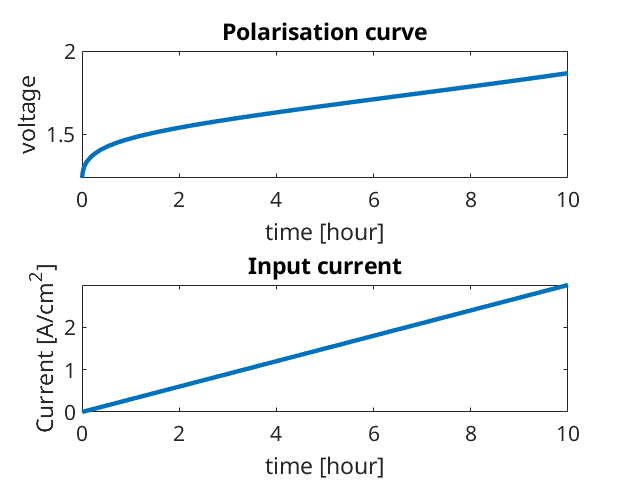

.. _runElectrolyser:

==============================
Alkaline Membrane Electrolyser
==============================
*Generated from runElectrolyser.m*

.. include:: runElectrolyserPreamble.rst

Setup input
===========
Setup the physical properties for the electrolyser using json input file :battmofile:`alkalineElectrolyser.json<Electrolyser/Parameters/alkalineElectrolyser.json>`

.. code-block:: matlab

  jsonstruct= parseBattmoJson('Electrolyser/Parameters/alkalineElectrolyser.json');
  inputparams = ElectrolyserInputParams(jsonstruct);

Setup the grids. We consider a 1D model and the specifications can be read from a json input file, here :battmofile:`electrolysergeometry1d.json<Electrolyser/Parameters/electrolysergeometry1d.json>`, using :battmo:`setupElectrolyserGridFromJson`.

.. code-block:: matlab

  jsonstruct= parseBattmoJson('Electrolyser/Parameters/electrolysergeometry1d.json');
  inputparams = setupElectrolyserGridFromJson(inputparams, jsonstruct);

We define shortcuts for the different submodels.

.. code-block:: matlab

  inm = 'IonomerMembrane';
  her = 'HydrogenEvolutionElectrode';
  oer = 'OxygenEvolutionElectrode';
  ptl = 'PorousTransportLayer';
  exr = 'ExchangeReaction';
  ctl = 'CatalystLayer';

Setup model
===========

.. code-block:: matlab

  model = Electrolyser(inputparams);

Setup the initial condition
===========================
We use the default initial setup implemented in the model

.. code-block:: matlab

  [model, initstate] = model.setupBcAndInitialState();

Setup the schedule with the time discretization
===============================================
We run the simulation over 10 hours, increasing the input current linearly in time.

.. code-block:: matlab

  total = 10*hour;
  
  n   = 100;
  dt  = total/n;
  dts = rampupTimesteps(total, dt, 5);

We use the function :battmo:`rampupControl` to increase the current linearly in time

.. code-block:: matlab

  controlI = -3*ampere/(centi*meter)^2; % if negative, O2 and H2 are produced
  tup      = total;
  srcfunc  = @(time) rampupControl(time, tup, controlI, 'rampupcase', 'linear');
  control  = struct('src', srcfunc);
  
  step = struct('val', dts, 'control', ones(numel(dts), 1));
  schedule = struct('control', control, 'step', step);

Setup the non-linear solver
===========================
We do only minor modifications here from the standard solver

.. code-block:: matlab

  nls = NonLinearSolver();
  nls.verbose = false;
  nls.errorOnFailure = false;
  
  model.verbose = false;

Run the simulation
==================

.. code-block:: matlab

  [~, states, report] = simulateScheduleAD(initstate, model, schedule, 'NonLinearSolver', nls, 'OutputMiniSteps', true);

Visualize the results
=====================
The results contain only the primary variables of the system (the unknwons that descrive the state of the system). We use the method :code:`addVariables` to add all the intermediate quantities that are computed to solve the equations but not stored automatically in the result.

.. code-block:: matlab

  for istate = 1 : numel(states)
      states{istate} = model.addVariables(states{istate});
  end

We extract the time, voltage and current values for each time step

.. code-block:: matlab

  time = cellfun(@(state) state.time, states);
  E    = cellfun(@(state) state.(oer).(ptl).E, states);
  I    = cellfun(@(state) state.(oer).(ctl).I, states);

We plot the results for the voltage and current

.. code-block:: matlab

  set(0, 'defaultlinelinewidth', 3)
  set(0, 'defaultaxesfontsize', 15)
  
  figure
  subplot(2, 1, 1)
  plot(time/hour, E)
  xlabel('time [hour]');
  ylabel('voltage');
  title('Polarisation curve');
  
  subplot(2, 1, 2)
  plot(time/hour, -I/(1/(centi*meter)^2));
  xlabel('time [hour]');
  ylabel('Current [A/cm^2]');
  title('Input current')

pH distribution plot
====================
We consider the three domains and plot the pH in each of those. We setup the helper structures to iterate over each domain for the plot.

.. code-block:: matlab

  models = {model.(oer).(ptl), ...
            model.(her).(ptl), ...
            model.(inm)};
  
  fields = {{'OxygenEvolutionElectrode', 'PorousTransportLayer', 'concentrations', 2}  , ...
            {'HydrogenEvolutionElectrode', 'PorousTransportLayer', 'concentrations', 2}, ...
            {'IonomerMembrane', 'cOH'}};
  
  h = figure();
  set(h, 'position', [10, 10, 800, 450]);
  hold on
  
  ntime = numel(time);
  times = linspace(1, ntime, 10);
  cmap  = cmocean('deep', 10);
  
  for ifield = 1 : numel(fields)
  
      fd       = fields{ifield};
      submodel = models{ifield};
  
      x    = submodel.grid.cells.centroids;
  
      for itimes = 1 : numel(times);
  
          itime = floor(times(itimes));
          % The method :code:`getProp` is used to recover the value from the state structure
          val   = model.getProp(states{itime}, fd);
          pH    = 14 + log10(val/(mol/litre));
  
          % plot of pH for the current submodel.
          plot(x/(milli*meter), pH, 'color', cmap(itimes, :));
  
      end
  
  end
  
  xlabel('x  /  mm');
  ylabel('pH');
  title('pH distribution in electrolyser')
  
  colormap(cmap)
  hColorbar = colorbar;
  caxis([0 3]);
  hTitle = get(hColorbar, 'Title');
  set(hTitle, 'string', 'J (A/cm^2)');

.. figure:: runElectrolyser_02.png
  :figwidth: 100%

complete source code can be found :ref:`here<runElectrolyser_source>`
