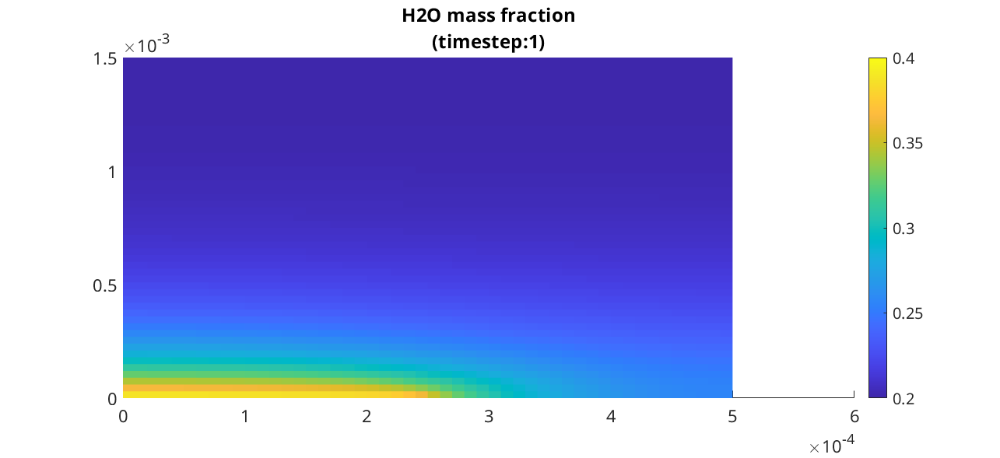
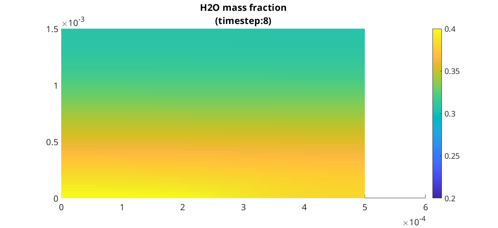

.. _runGasSupply:

================
Gas Supply Layer
================
*Generated from runGasSupply.m*

.. include:: runGasSupplyPreamble.rst

json input data
===============
We load the input data that is given by json structures. The physical properties of the supply gas layer is given in the json file :battmofile:`gas-supply.json <ProtonicMembrane/jsonfiles/gas-supply.json>`

.. code-block:: matlab

  filename = fullfile(battmoDir(), 'ProtonicMembrane', 'jsonfiles', 'gas-supply.json');
  jsonstruct_material = parseBattmoJson(filename);

The geometry input is loaded from :battmofile:`2d-gas-layer-geometry.json <ProtonicMembrane/jsonfiles/2d-gas-layer-geometry.json>`

.. code-block:: matlab

  filename = fullfile(battmoDir(), 'ProtonicMembrane', 'jsonfiles', '2d-gas-layer-geometry.json');
  jsonstruct_geometry = parseBattmoJson(filename);

The input for the initial state is loaded from :battmofile:`gas-supply-initialization.json <ProtonicMembrane/jsonfiles/gas-supply-initialization.json>`

.. code-block:: matlab

  filename = fullfile(battmoDir(), 'ProtonicMembrane', 'jsonfiles', 'gas-supply-initialization.json');
  jsonstruct_initialization = parseBattmoJson(filename);
  
  jsonstruct = mergeJsonStructs({jsonstruct_material, ...
                                 jsonstruct_geometry, ...
                                 jsonstruct_initialization});

Input parameter setup
=====================
We setup the input parameter structure which will we be used to instantiate the model

.. code-block:: matlab

  inputparams = ProtonicMembraneGasSupplyInputParams(jsonstruct);

We setup the grid, which is done by calling the function :battmo:`setupProtonicMembraneGasLayerGrid`

.. code-block:: matlab

  [inputparams, gridGenerator] = setupProtonicMembraneGasLayerGrid(inputparams, jsonstruct);

Model setup
===========
We instantiate the model for the gas supply layer

.. code-block:: matlab

  model = ProtonicMembraneGasSupply(inputparams);

The model is equipped for simulation using the following command (this step may become unnecessary in future versions)

.. code-block:: matlab

  model = model.setupForSimulation();

Model Plot
==========
We plot the simulation grid

.. code-block:: matlab

  G = model.grid;
  
  plotGrid(G);

The boundary conditions have been given by the input json file, see :battmofile:`gas-supply.json <ProtonicMembrane/jsonfiles/gas-supply.json#16>`. In this case we have rate control at the inlet at the bottom, and pressure control at the outlet at the top.
The index of the faces for the inlet and outlet are stored in a :code:`couplingTerm` structure (see :battmo:`here <couplingTerm>` for the base class). Those have been assigned when the grid is setup (for this example we have used :battmo:`GasSupplyGridGenerator2D`).
We plot the inlet faces.

.. code-block:: matlab

  coupTerm = model.couplingTerms{1};
  plotFaces(G, coupTerm.couplingfaces, 'edgecolor', 'blue', 'linewidth', 3)

We plot the outlet faces.

.. code-block:: matlab

  coupTerm = model.couplingTerms{2};
  plotFaces(G, coupTerm.couplingfaces, 'edgecolor', 'red', 'linewidth', 3)

Setup initial state
===================
The model provides us with a default initialization

.. code-block:: matlab

  initstate = model.setupInitialState(jsonstruct);

Schedule setup
==============
The schedule structure constains two fields :code:`step`, :code:`control`, which gives respectively the time steps and the control to be applied.

.. code-block:: matlab

  T  = 1e-2*second;
  N  = 10;
  
  dt = rampupTimesteps(T, T/N, 1);
  
  step.val = dt;
  step.control = ones(numel(step.val), 1);
  
  control.src = []; % The control is taking care of by a dedicated submobel. Hence, the empty field here.
  
  schedule = struct('control', control, 'step', step);

Simulation
==========
We start the simulation

.. code-block:: matlab

  [~, states, report] = simulateScheduleAD(initstate, model, schedule);

Result plots
============
To analyse the result, we can use the interactive :code:`plotToolbar` command (see :mrstfile:`here <visualization/mrst-gui/plotToolbar.m>`)

.. code-block:: matlab

  figure
  plotToolbar(model.grid, states);
  %
  %

We plot the pressure at the final step.

.. code-block:: matlab

  set(0, 'defaultlinelinewidth', 3);
  set(0, 'defaultaxesfontsize', 15);
  
  state = states{end};
  
  G = model.grid;
  
  figure
  plotCellData(G, state.pressure/barsa);
  colorbar
  title('Pressure / bar');

We plot the water mass fractions at three different time step

.. code-block:: matlab

  inds = [1; 2; 4; 8];
  ninds = numel(inds);
  for i = 1 : ninds
      figure
      state = states{inds(i)};
      plotCellData(G, state.massfractions{1}, 'edgecolor', 'none');
      clim([0.2, 0.4]);
      title(sprintf('H2O mass fraction\n(timestep:%d)', inds(i)));
      colorbar
  end

complete source code can be found :ref:`here<runGasSupply_source>`
