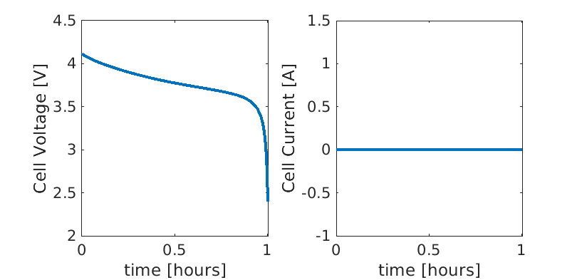

.. _runJsonScript:

BattMo example Json input
---------------------------------------------
*Generated from runJsonScript.m*

This script shows an example where we setup a simulation using exclusively json input files.

Setting up the environment
^^^^^^^^^^^^^^^^^^^^^^^^^^
BattMo uses functionality from :mod:`MRST <MRSTBattMo>`. This functionality is collected into modules where each module contains code for doing specific things. To use this functionality we must add these modules to the matlab path by running:

.. code-block:: matlab

  mrstModule add ad-core mrst-gui

We load the json files
^^^^^^^^^^^^^^^^^^^^^^
When loading a json file using :code:`parseBattmoJson`, the output is the standard matlab structure that is obtained by the native matlab command :code:`jsondecode`, see `here <https://se.mathworks.com/help/matlab/ref/jsondecode.html>`_

Material properties
^^^^^^^^^^^^^^^^^^^
We load the json structure for the material properties

.. code-block:: matlab

  jsonfilename = fullfile('ParameterData', 'BatteryCellParameters', 'LithiumIonBatteryCell', ...
                          'lithium_ion_battery_nmc_graphite.json');
  jsonstruct_material = parseBattmoJson(jsonfilename);

Geometry
^^^^^^^^
We load the json structure for the geometrical properties

.. code-block:: matlab

  jsonfilename = fullfile('Examples', 'JsonDataFiles', 'geometry1d.json');
  jsonstruct_geometry = parseBattmoJson(jsonfilename);

Control
^^^^^^^
We load the json structure for the geometrical properties

.. code-block:: matlab

  jsonfilename = fullfile('Examples', 'JsonDataFiles', 'cc_discharge_control.json');
  jsonstruct_control = parseBattmoJson(jsonfilename);

Simulation parameters
^^^^^^^^^^^^^^^^^^^^^
We load the json structure for the simulation parameters

.. code-block:: matlab

  jsonfilename = fullfile('Examples', 'JsonDataFiles', 'simulation_parameters.json');
  jsonstruct_simparams = parseBattmoJson(jsonfilename);

Ouput specificiations
^^^^^^^^^^^^^^^^^^^^^
We load the json structure for output extra specifications.

.. code-block:: matlab

  jsonfilename = fullfile('Examples', 'JsonDataFiles', 'extra_output.json');
  jsonstruct_output = parseBattmoJson(jsonfilename);

We merge the json structures. The function issues a warning if a parameter is set with different values in the given structures. The rule is that the first value takes precedence.

.. code-block:: matlab

  jsonstruct = mergeJsonStructs({jsonstruct_geometry , ...
                                 jsonstruct_material , ...
                                 jsonstruct_control  , ...
                                 jsonstruct_simparams, ...
                                 jsonstruct_output   , ...
                                });

We adjust the total time with respect to the given CRate.

.. code-block:: matlab

  CRate = jsonstruct.Control.CRate;
  jsonstruct.TimeStepping.totalTime = 1.4*hour/CRate;
  jsonstruct.TimeStepping.numberOfTimeSteps = 40;

We start the simulation
^^^^^^^^^^^^^^^^^^^^^^^
We use the function :code:`runBatteryJson` to run the simulation with json input structure

.. code-block:: matlab

  output = runBatteryJson(jsonstruct);

Plotting
^^^^^^^^

.. code-block:: matlab

  states = output.states;

  E = cellfun(@(x) x.Control.E, states);
  I = cellfun(@(x) x.Control.I, states);
  time = cellfun(@(x) x.time, states);

  figure()
  subplot(1,2,1)
  plot(time/hour, E)
  xlabel('time [hours]')
  ylabel('Cell Voltage [V]')

  subplot(1,2,2)
  plot(time/hour, I)
  xlabel('time [hours]')
  ylabel('Cell Current [A]')

complete source code can be found :ref:`here<runJsonScript_source>`
