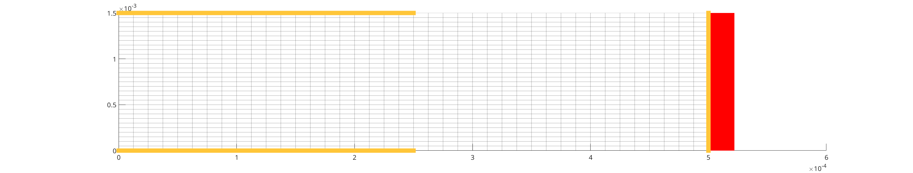
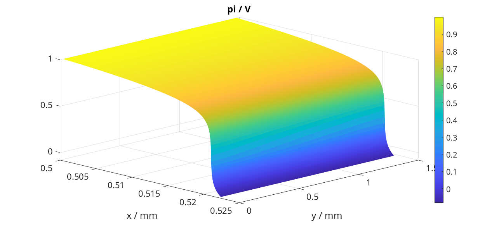
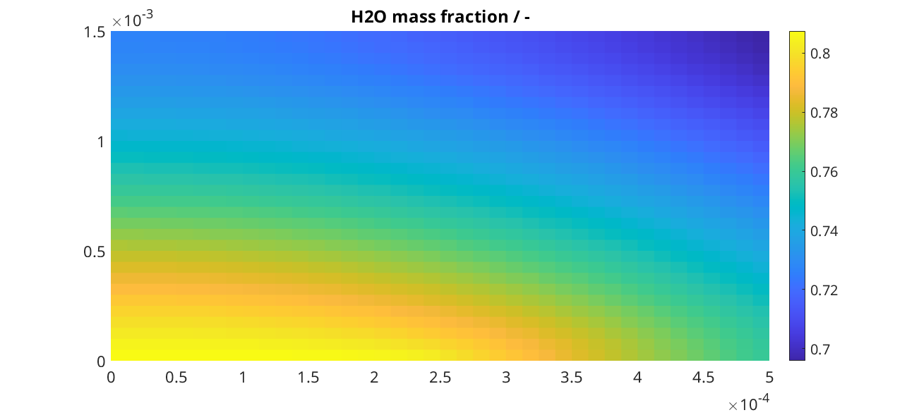

.. _runProtonicCell:

================================
PEM electrolyser with Gas Supply
================================
*Generated from runProtonicCell.m*

.. include:: runProtonicCellPreamble.rst

json input data
===============
We load the input data that is given by json structures. The physical properties of the supply gas layer is given in the json file :battmofile:`gas-supply-whole-cell.json <ProtonicMembrane/jsonfiles/gas-supply-whole-cell.json>`

.. code-block:: matlab

  clear jsonstruct_material
  filename = 'ProtonicMembrane/jsonfiles/gas-supply-whole-cell.json';
  jsonstruct_material.GasSupply = parseBattmoJson(filename);
  filename = 'ProtonicMembrane/jsonfiles/protonicMembrane.json';
  jsonstruct_material.Electrolyser = parseBattmoJson(filename);
  
  jsonstruct_material = removeJsonStructFields(jsonstruct_material, ...
                                               {'Electrolyser', 'Electrolyte', 'Nx'}, ...
                                               {'Electrolyser', 'Electrolyte', 'xlength'});

The geometrical property of the cell is given in :battmofile:`2d-cell-geometry.json <ProtonicMembrane/jsonfiles/2d-cell-geometry.json>`

.. code-block:: matlab

  filename = 'ProtonicMembrane/jsonfiles/2d-cell-geometry.json';
  jsonstruct_geometry = parseBattmoJson(filename);

The initial state is given in :battmofile:`gas-supply-initialization.json <ProtonicMembrane/jsonfiles/gas-supply-initialization.json>`

.. code-block:: matlab

  filename = 'ProtonicMembrane/jsonfiles/gas-supply-initialization.json';
  jsonstruct_initialization.GasSupply = parseBattmoJson(filename);

The time stepping parameters are given in :battmofile:`cell-timestepping.json <ProtonicMembrane/jsonfiles/cell-timestepping.json>`

.. code-block:: matlab

  filename = 'ProtonicMembrane/jsonfiles/cell-timestepping.json';
  jsonstruct_timestepping = parseBattmoJson(filename);

We merge all the json struct we have created to obtain a complete json structure that can be use to setup the model

.. code-block:: matlab

  jsonstruct = mergeJsonStructs({jsonstruct_material      , ...
                                 jsonstruct_geometry      , ...
                                 jsonstruct_initialization, ...
                                 jsonstruct_timestepping});

We change the value of the current density to the value we want to use in this simulation

.. code-block:: matlab

  jsonstruct.Electrolyser.Control.currentDensity = 0.1*ampere/((centi*meter)^2);

Input parameter setup
=====================
We setup the input parameter structure which will we be used to instantiate the model

.. code-block:: matlab

  inputparams = ProtonicMembraneCellInputParams(jsonstruct);

We setup the grid, by calling the function :battmo:`setupProtonicMembraneGasLayerGrid`

.. code-block:: matlab

  [inputparams, gen] = setupProtonicMembraneCellGrid(inputparams, jsonstruct);

Model setup
===========
We setup the model for the full cell (electrolyser and a gas supply layer).

.. code-block:: matlab

  model = ProtonicMembraneCell(inputparams);

The model is equipped for simulation using the following command (this step may become unnecessary in future versions)

.. code-block:: matlab

  model = model.setupForSimulation();

Grid plots
==========
We plot the different regions with their grids.
To resolve the non-linearity in the electrolyte, we need a very fine mesh. Plotting the full mesh including the edges for this domain will hide its structure. Therefore we set the option :code:`edgecolor` to :code:`none`.

.. code-block:: matlab

  figure('position', [337, 757, 3068, 557])
  hold on
  plotGrid(model.grid, 'edgecolor', 'none')
  plotGrid(model.Electrolyser.grid, 'facecolor', 'red', 'edgecolor', 'none')
  plotGrid(model.GasSupply.grid, 'facecolor', 0.9*[0 1 1], 'edgealpha', 0.2)

.. figure:: runProtonicCell_01.png
  :figwidth: 100%

We plot the boundary and interface faces

.. code-block:: matlab

  s = spring(10);
  opts = {'linewidth', 10, ...
          'edgecolor', s(8, :)};

we plot the inlet faces

.. code-block:: matlab

  figure('position', [337, 757, 3068, 557])
  plotGrid(model.Electrolyser.grid, 'facecolor', 'red', 'edgecolor', 'none')
  plotGrid(model.GasSupply.grid, 'facecolor', 'none', 'edgealpha', 0.2)
  plotFaces(model.GasSupply.grid, model.GasSupply.couplingTerms{1}.couplingfaces, opts{:});

we add the outlet faces

.. code-block:: matlab

  plotFaces(model.GasSupply.grid, model.GasSupply.couplingTerms{2}.couplingfaces, opts{:});

we add the interface faces

.. code-block:: matlab

  plotFaces(model.GasSupply.grid, model.couplingTerm.couplingfaces(:, 1) , opts{:});

Setup initial state
===================
The initial state for the cell is used using the initial state of the gas layer that have been loaded (see :battmofile:`here <ProtonicMembrane/jsonfiles/gas-supply-initialization.json>`)

.. code-block:: matlab

  initstate = model.setupInitialState(jsonstruct);

Setup schedule
==============
We setup the time stepping. We are computing the steady state solution, using the the time evolution equation. Note that we also use a numerical method which gradually introduces the high nonlinearities inherent to the problem (in particular the exponential dependence of the electronic conductivity in the membrane). Therefore, the intermediate solutions (i.e. those computed before the final step) should be considered with care.

.. code-block:: matlab

  schedule = model.setupSchedule(jsonstruct);

Setup nonlinear solver
======================
We use an adaptive time stepping. In this case, the solver will try to keep the number of timesteps equal to 5, based on the timestepping history.

.. code-block:: matlab

  ts = IterationCountTimeStepSelector('targetIterationCount', 5);
  
  nls = NonLinearSolver();
  nls.timeStepSelector = ts;
  nls.maxIterations    = 15;

Start simulation
================
We start the simulation

.. code-block:: matlab

  [~, states, report] = simulateScheduleAD(initstate, model, schedule, 'OutputMinisteps', true, 'NonLinearSolver', nls);

plotting setup
==============

.. code-block:: matlab

  close all
  
  set(0, 'defaultlinelinewidth', 3);
  set(0, 'defaultaxesfontsize', 15);
  set(0, 'defaultfigureposition', [1290, 755, 1275, 559])
  
  elyser = 'Electrolyser';
  elyte  = 'Electrolyte';
  gs     = 'GasSupply';
  
  state = states{end};
  state = model.addVariables(state);

Electrolyte results
===================
We plot the electrostatic potential :math:`\phi` (we need to remove the plotting of the grid edges, otherwise due to the grid refinement, they will hide completely the color of the field)

.. code-block:: matlab

  figure
  plotCellData(model.(elyser).(elyte).grid, state.(elyser).(elyte).phi, 'edgecolor', 'none');
  title('Electrostatic Potential \phi / V')
  colorbar

We want also to plot the result as a surface plot. Then, we need to manipulate the output and make it suitable to the :code:`surf` function of matlab (we do not explain those details here)

.. code-block:: matlab

  N = gen.nxElectrolyser;
  xc = model.(elyser).(elyte).grid.cells.centroids(1 : N, 1);
  
  X = reshape(model.(elyser).(elyte).grid.cells.centroids(:, 1), N, [])/(milli*meter);
  Y = reshape(model.(elyser).(elyte).grid.cells.centroids(:, 2), N, [])/(milli*meter);
  
  figure
  val = state.(elyser).(elyte).phi;
  Z = reshape(val, N, []);
  surf(X, Y, Z, 'edgecolor', 'none');
  title('\phi / V')
  xlabel('x / mm')
  ylabel('y / mm')
  view(45, 31)
  colorbar

We produce a surface plot of the electromotive potential :math:`\pi`.

.. code-block:: matlab

  figure
  val = state.(elyser).(elyte).pi;
  Z = reshape(val, N, []);
  surf(X, Y, Z, 'edgecolor', 'none');
  title('pi / V')
  xlabel('x / mm')
  ylabel('y / mm')
  view(45, 31)
  colorbar

Gas Layer results
=================
We plot the H2O mass fraction in the gas diffusion layer. We observe how the water is being first consumed close to the inlet (inlet is at bottom, outlet at top).

.. code-block:: matlab

  figure
  plotCellData(model.(gs).grid, state.(gs).massfractions{1}, 'edgecolor', 'none');
  title('H2O mass fraction / -')
  colorbar

We plot the same result as a surface plot

.. code-block:: matlab

  N = gen.nxGasSupply;
  
  X = reshape(model.(gs).grid.cells.centroids(:, 1), N, [])/(milli*meter);
  Y = reshape(model.(gs).grid.cells.centroids(:, 2), N, [])/(milli*meter);
  
  
  val = state.(gs).massfractions{1};
  Z = reshape(val, N, []);
  
  surf(X, Y, Z, 'edgecolor', 'none');
  colorbar
  title('Mass Fraction H2O');
  xlabel('x / mm')
  ylabel('y / mm')
  view([50, 51]);

.. figure:: runProtonicCell_09.png
  :figwidth: 100%

We plot the O2 mass fraction

.. code-block:: matlab

  figure('position', [1290, 755, 1275, 559])
  
  val = state.(gs).massfractions{2};
  Z = reshape(val, N, []);
  
  surf(X, Y, Z, 'edgecolor', 'none');
  colorbar
  title('Mass Fraction O2');
  xlabel('x / mm')
  ylabel('y / mm')
  view([50, 51]);

Interface results
=================
Current density in the anode. We recover the current on each face along the anode.

.. code-block:: matlab

  i = state.Electrolyser.Anode.i;

From the current values at each face, we compute the current density by dividing with the face areas.

.. code-block:: matlab

  ind   = model.Electrolyser.couplingTerms{1}.couplingfaces(:, 2);
  yc    = model.Electrolyser.Electrolyte.grid.faces.centroids(ind, 2);
  areas = model.Electrolyser.Electrolyte.grid.faces.areas(ind);
  
  u = ampere/((centi*meter)^2);
  i = (i./areas)/u; % We convert to A/cm^2
  
  figure
  plot(yc/(milli*meter), i);
  title('Current in Anode / A/cm^2')
  xlabel('height / mm')

We do the same but now for the proton current.

.. code-block:: matlab

  iHp = state.Electrolyser.Anode.iHp;
  
  ind   = model.Electrolyser.couplingTerms{1}.couplingfaces(:, 2);
  yc    = model.Electrolyser.Electrolyte.grid.faces.centroids(ind, 2);
  areas = model.Electrolyser.Electrolyte.grid.faces.areas(ind);
  
  u = ampere/((centi*meter)^2);
  iHp = (iHp./areas)/u;
  
  figure
  plot(yc/(milli*meter), iHp);
  title('iHp in Anode / A/cm^2')
  xlabel('height / mm')

By dividing the proton current density with the total current density, we obtain the Faradic efficiency.

.. code-block:: matlab

  % drivingForces.src = schedule.control.src;
  % state = model.evalVarName(state, 'Electrolyser.Anode.iHp', {{'drivingForces', drivingForces}});
  
  i   = state.Electrolyser.Anode.i;
  iHp = state.Electrolyser.Anode.iHp;
  
  ind = model.Electrolyser.couplingTerms{1}.couplingfaces(:, 2);
  yc  = model.Electrolyser.Electrolyte.grid.faces.centroids(ind, 2);
  
  figure
  plot(yc/(milli*meter), iHp./i);
  title('Faradic efficiency')
  xlabel('height / mm')

complete source code can be found :ref:`here<runProtonicCell_source>`
