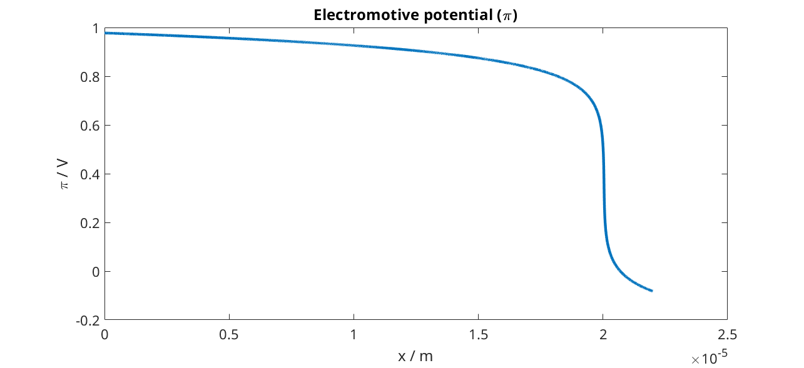
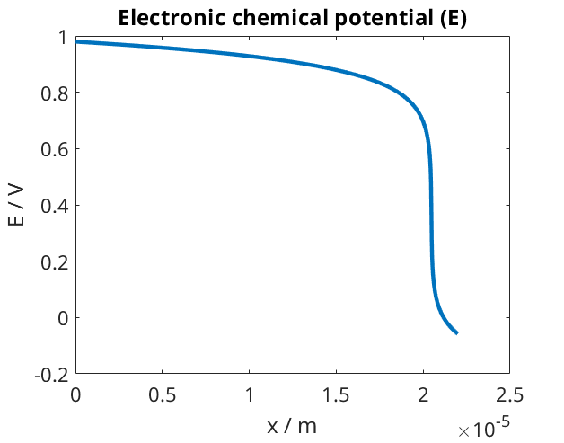
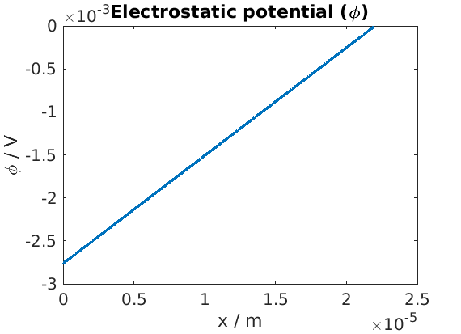
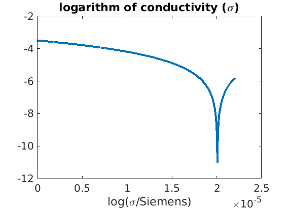
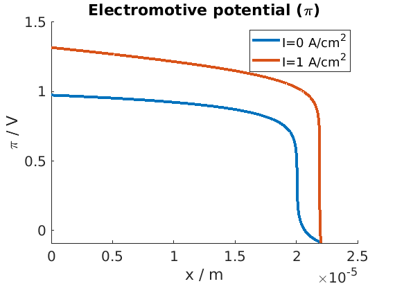
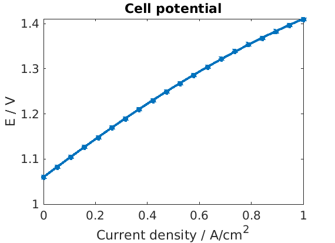
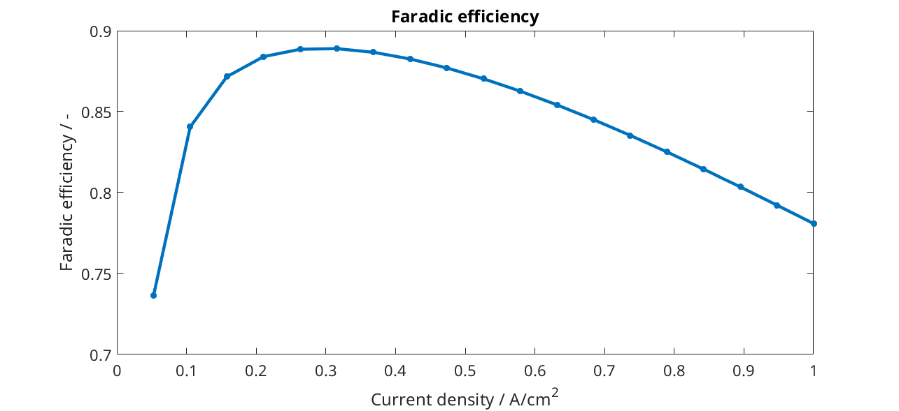

.. _runProtonicMembrane:

==========================================
Proton Ceramic Electrolyser Membrane model
==========================================
*Generated from runProtonicMembrane.m*

.. include:: runProtonicMembranePreamble.rst

Load and parse input from given json files
==========================================
The source of the json files can be seen in :battmofile:`protonicMembrane.json<ProtonicMembrane/jsonfiles/protonicMembrane.json>` and :battmofile:`1d-PM-geometry.json<ProtonicMembrane/jsonfiles/1d-PM-geometry.json>`

.. code-block:: matlab

  filename = fullfile(battmoDir(), 'ProtonicMembrane', 'jsonfiles', 'protonicMembrane.json');
  jsonstruct_material = parseBattmoJson(filename);
  
  filename = fullfile(battmoDir(), 'ProtonicMembrane', 'jsonfiles', '1d-PM-geometry.json');
  jsonstruct_geometry = parseBattmoJson(filename);
  
  jsonstruct = mergeJsonStructs({jsonstruct_material, jsonstruct_geometry});

Input structure setup
=====================
We setup the input parameter structure which will we be used to instantiate the model

.. code-block:: matlab

  inputparams = ProtonicMembraneInputParams(jsonstruct);

We setup the grid, which is done by calling the function :battmo:`setupProtonicMembraneGrid`

.. code-block:: matlab

  [inputparams, gen] = setupProtonicMembraneGrid(inputparams, jsonstruct);

Model setup
===========
We instantiate the model for the proton membrane cell

.. code-block:: matlab

  model = ProtonicMembrane(inputparams);

The model is equipped for simulation using the following command (this step may become unnecessary in future versions)

.. code-block:: matlab

  model = model.setupForSimulation();

Initial state setup
===================
We setup the initial state using a default setup included in the model

.. code-block:: matlab

  state0 = model.setupInitialState();

Schedule
========
We setup the schedule, which means the timesteps and also the control we want to use. In this case we use current control and the current equal to zero (see :battmofile:`here <ProtonicMembrane/jsonfiles/protonicMembrane.json#118>`).
We compute the steady-state solution and the time stepping here does not correspond to time values but should be seen as step-wise increase of the effect of the non-linearity (in particular in the expression of the conductivity which includes highly nonlineaer effect with the exponential terms. We do not detail here the method).

.. code-block:: matlab

  schedule = model.Control.setupSchedule(jsonstruct);

Simulation
==========
We run the simulation

.. code-block:: matlab

  [~, states, report] = simulateScheduleAD(state0, model, schedule);

Plotting
========
We setup som shortcuts for convenience and introduce plotting options

.. code-block:: matlab

  an    = 'Anode';
  ct    = 'Cathode';
  elyte = 'Electrolyte';
  ctrl  = 'Control';
  
  set(0, 'defaultlinelinewidth', 3);
  set(0, 'defaultaxesfontsize', 15);

We recover the position of the mesh cell of the discretization grid. This is used when plotting the spatial distribution of some of the variables.

.. code-block:: matlab

  xc = model.(elyte).grid.cells.centroids(:, 1);

We consider the solution obtained at the last time step, which corresponds to the solution at steady-state. The second line adds to the state variable all the variables that are derived from our primary unknowns.

.. code-block:: matlab

  state = states{end};
  state = model.addVariables(state, schedule.control);

Plot of electromotive potential

.. code-block:: matlab

  figure
  plot(xc, state.(elyte).pi)
  title('Electromotive potential (\pi)')
  xlabel('x / m')
  ylabel('\pi / V')

Plot of electronic chemical potential

.. code-block:: matlab

  figure
  plot(xc, state.(elyte).pi - state.(elyte).phi)
  title('Electronic chemical potential (E)')
  xlabel('x / m')
  ylabel('E / V')

Plot of electrostatic potential

.. code-block:: matlab

  figure
  plot(xc, state.(elyte).phi)
  title('Electrostatic potential (\phi)')
  xlabel('x / m')
  ylabel('\phi / V')

Plot of the conductivity

.. code-block:: matlab

  figure
  plot(xc, log(state.(elyte).sigmaEl))
  title('logarithm of conductivity (\sigma)')
  xlabel('x / m')
  xlabel('log(\sigma/Siemens)')

Evolution of the Faradic efficiency
===================================
We increase the current density from 0 to 1 A/cm^2 and plot the faraday efficiency.
We sample the current value from 0 to 1 A/cm^2.

.. code-block:: matlab

  Is = linspace(0, 1*ampere/((centi*meter)^2), 20);

We run the simulation for each current value and collect the results in the :code:`endstates`.

.. code-block:: matlab

  endstates = {};
  for iI = 1 : numel(Is)
  
      model.Control.I = Is(iI);
      [~, states, report] = simulateScheduleAD(state0, model, schedule);
  
      state = states{end};
      state = model.addVariables(state, schedule.control);
  
      endstates{iI} = state;
  
  end

We plot the profile of the electromotive potential for the mininum and maximum current values.

.. code-block:: matlab

  figure
  hold on
  
  unit = ampere/((centi*meter)^2); % shortcut
  
  state = endstates{1};
  plot(xc, state.(elyte).pi, 'displayname', sprintf('I=%g A/cm^2', Is(1)/unit));
  state = endstates{end};
  plot(xc, state.(elyte).pi, 'displayname', sprintf('I=%g A/cm^2', Is(end)/unit));
  
  title('Electromotive potential (\pi)')
  xlabel('x / m')
  ylabel('\pi / V')
  legend

We retrieve and plot the cell potential

.. code-block:: matlab

  E = cellfun(@(state) state.(an).pi - state.(ct).pi, endstates);
  
  figure
  plot(Is/unit, E, '*-');
  xlabel('Current density / A/cm^2')
  ylabel('E / V')
  title('Cell potential');

We retrieve and plot the Faradic efficiency

.. code-block:: matlab

  feff = cellfun(@(state) state.(an).iHp/state.(an).i, endstates);
  
  figure
  plot(Is/unit, feff, '*-');
  xlabel('Current density / A/cm^2')
  ylabel('Faradic efficiency / -')
  title('Faradic efficiency');

complete source code can be found :ref:`here<runProtonicMembrane_source>`
