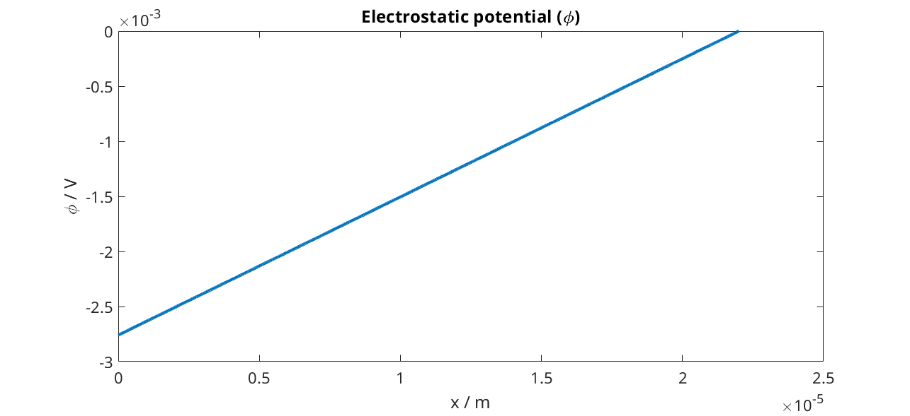
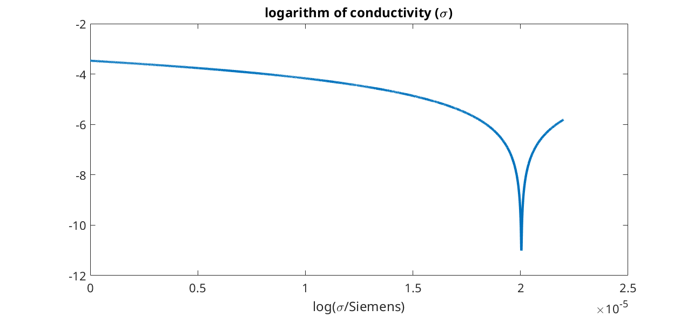

.. _runProtonicMembrane:

=======================
Protonic Membrane model
=======================
*Generated from runProtonicMembrane.m*

.. include:: runProtonicMembranePreamble.rst

Load and parse input from given json files
==========================================
The source of the json files can be seen in :battmofile:`protonicMembrane<ProtonicMembrane/jsonfiles/protonicMembrane.json>` and :battmofile:`1d-PM-geometry.json<ProtonicMembrane/jsonfiles/1d-PM-geometry.json>`

.. code-block:: matlab

  filename = fullfile(battmoDir(), 'ProtonicMembrane', 'jsonfiles', 'protonicMembrane.json');
  jsonstruct_material = parseBattmoJson(filename);
  
  filename = fullfile(battmoDir(), 'ProtonicMembrane', 'jsonfiles', '1d-PM-geometry.json');
  jsonstruct_geometry = parseBattmoJson(filename);
  
  jsonstruct = mergeJsonStructs({jsonstruct_material, jsonstruct_geometry});

Input structure setup
=====================
We setup the input parameter structure which will we be used to instantiate the model

.. code-block:: matlab

  inputparams = ProtonicMembraneCellInputParams(jsonstruct);
  
  % We setup the grid, which is done by calling the function :battmo:`setupProtonicMembraneCellGrid`
  [inputparams, gen] = setupProtonicMembraneCellGrid(inputparams, jsonstruct);

Model setup
===========
We instantiate the model for the protonic membrane cell

.. code-block:: matlab

  model = ProtonicMembraneCell(inputparams);

The model is equipped for simulation using the following command (this step may become unnecessary in future versions)

.. code-block:: matlab

  model = model.setupForSimulation();

Initial state setup
===================
We setup the initial state using a default setup included in the model

.. code-block:: matlab

  state0 = model.setupInitialState();

Schedule schedule
=================
We setup the schedule, which means the timesteps and also the control we want to use. In this case we use current control and the current equal to zero (see here :battmofile:`here<ProtonicMembrane/protonicMembrane.json#86>`).
We compute the steady-state solution so that the time stepping here is more an artifact to reach the steady-state solution. In particular, it governs the pace at which we increase the non-linearity (not detailed here).

.. code-block:: matlab

  schedule = model.Control.setupSchedule(inputparams.jsonstruct);

We change the default tolerance

.. code-block:: matlab

  model.nonlinearTolerance = 1e-8;

Simulation
==========
We run the simulation

.. code-block:: matlab

  [~, states, report] = simulateScheduleAD(state0, model, schedule);

Plotting
========
We setup som shortcuts for convenience

.. code-block:: matlab

  an    = 'Anode';
  ct    = 'Cathode';
  elyte = 'Electrolyte';
  ctrl  = 'Control';
  
  set(0, 'defaultlinelinewidth', 3);
  set(0, 'defaultaxesfontsize', 15);

We recover the position of the mesh cell of the discretization grid. This is used when plotting the spatial distribution of some of the variables.

.. code-block:: matlab

  xc = model.(elyte).grid.cells.centroids(:, 1);

We consider the solution obtained at the last time step, which corresponds to the solution at steady-state.

.. code-block:: matlab

  state = states{end};
  state = model.addVariables(state, schedule.control);
  
  figure(1)
  plot(xc, state.(elyte).pi)
  title('Electromotive potential (\pi)')
  xlabel('x / m')
  ylabel('\pi / V')
  
  figure(2)
  plot(xc, state.(elyte).pi - state.(elyte).phi)
  title('Electronic chemical potential (E)')
  xlabel('x / m')
  ylabel('E / V')
  
  figure(3)
  plot(xc, state.(elyte).phi)
  title('Electrostatic potential (\phi)')
  xlabel('x / m')
  ylabel('\phi / V')
  
  figure(4)
  plot(xc, log(state.(elyte).sigmaEl))
  title('logarithm of conductivity (\sigma)')
  xlabel('x / m')
  xlabel('log(\sigma/Siemens)')

.. figure:: runProtonicMembrane_01.png
  :figwidth: 100%

.. figure:: runProtonicMembrane_02.png
  :figwidth: 100%

complete source code can be found :ref:`here<runProtonicMembrane_source>`
