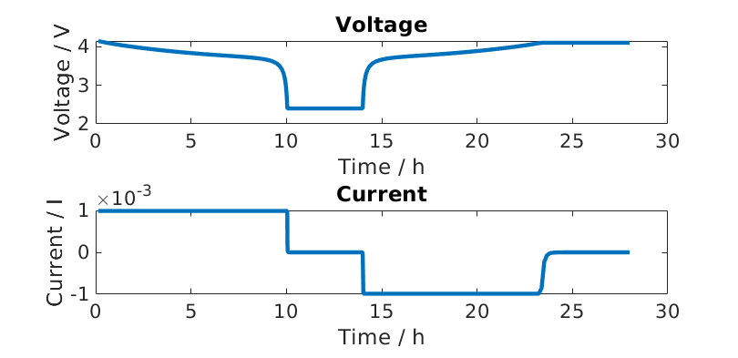

.. _runSiliconGraphiteBattery:

Composite Silicon Graphite electrode
--------------------------------------------------------------------
*Generated from runSiliconGraphiteBattery.m*

Import the required modules from MRST
^^^^^^^^^^^^^^^^^^^^^^^^^^^^^^^^^^^^^
load MRST modules

.. code-block:: matlab

  mrstModule add ad-core matlab_bgl

Shortcuts
^^^^^^^^^
We define shorcuts for the sub-models.

.. code-block:: matlab

  ne = 'NegativeElectrode';
  pe = 'PositiveElectrode';
  co = 'Coating';
  
  am1 = 'ActiveMaterial1';
  am2 = 'ActiveMaterial2';
  
  bd = 'Binder';
  ad = 'ConductingAdditive';
  
  sd  = 'SolidDiffusion';
  itf = 'Interface';

Setup the properties of the battery
^^^^^^^^^^^^^^^^^^^^^^^^^^^^^^^^^^^
We load the property of a composite silicon graphite electrode, see :ref:`compositeElectrode`

.. code-block:: matlab

  jsonstruct_composite_material = parseBattmoJson('ParameterData/BatteryCellParameters/LithiumIonBatteryCell/lithium_ion_battery_nmc_silicon_graphite.json');

For the remaining properties, we consider a standard data set

.. code-block:: matlab

  jsonstruct_cell = parseBattmoJson('ParameterData/BatteryCellParameters/LithiumIonBatteryCell/lithium_ion_battery_nmc_graphite.json');

We remove form the standard data set the :code:`ActiveMaterial` field. This step is not necessary but is cleaner and we avoid a warning.

.. code-block:: matlab

  jsonstruct_cell.(ne).(co) = rmfield(jsonstruct_cell.(ne).(co), 'ActiveMaterial');

We merge the two json structures

.. code-block:: matlab

  jsonstruct = mergeJsonStructs({jsonstruct_composite_material, ...
                                 jsonstruct_cell});

We do not consider the thermal model and remove the current collector

.. code-block:: matlab

  jsonstruct.use_thermal = false;
  jsonstruct.include_current_collectors = false;

We instantiate the battery :code:`InputParams` object

.. code-block:: matlab

  inputparams = BatteryInputParams(jsonstruct);

We set the mass fractions of the different material in the coating of the negative electrode. This information could have been passed in the json file earlier (:ref:`compositeElectrode`)

.. code-block:: matlab

  inputparams.(ne).(co).(am1).massFraction = 0.9;
  inputparams.(ne).(co).(am2).massFraction = 0.08;
  inputparams.(ne).(co).(bd).massFraction  = 0.01;
  inputparams.(ne).(co).(ad).massFraction  = 0.01;

We change the given CRate

.. code-block:: matlab

  inputparams.Control.CRate = 0.1;

We validate the :code:`InputParams` using the method :code:`validateInputParams` which belongs to the parent class. This step

.. code-block:: matlab

  Inputparams = inputparams.validateInputParams();
  
  gen = BatteryGeneratorP2D();

Now, we update the inputparams with the properties of the mesh.

.. code-block:: matlab

  inputparams = gen.updateBatteryInputParams(inputparams);

Model Instantiation
^^^^^^^^^^^^^^^^^^^
We instantiate the model

.. code-block:: matlab

  model = Battery(inputparams);

Setup schedule (control and time stepping)
^^^^^^^^^^^^^^^^^^^^^^^^^^^^^^^^^^^^^^^^^^
We will simulate two consecutive periods: a discharge followed by a charge.
We start with the charge period

.. code-block:: matlab

  CRate = model.Control.CRate;
  
  total = 1.4*hour/CRate;
  
  n  = 100;
  dt = total/n;
  step = struct('val', dt*ones(n, 1), 'control', ones(n, 1));
  
  tup = 0.1; % rampup value for the current function, see rampupSwitchControl
  srcfunc = @(time, I, E) rampupSwitchControl(time, tup, I, E, ...
                                              model.Control.Imax, ...
                                              model.Control.lowerCutoffVoltage);
  control = struct('src', srcfunc, 'CCDischarge', true);
  
  schedule = struct('control', control, 'step', step);

Setup the initial state of the model
^^^^^^^^^^^^^^^^^^^^^^^^^^^^^^^^^^^^
We use the default initialisation given by a method in the model

.. code-block:: matlab

  initstate = model.setupInitialState();

Setup the properties of the nonlinear solver
^^^^^^^^^^^^^^^^^^^^^^^^^^^^^^^^^^^^^^^^^^^^
We adjust some settings for the nonlinear solver

.. code-block:: matlab

  nls = NonLinearSolver();

Change default maximum iteration number in nonlinear solver

.. code-block:: matlab

  nls.maxIterations = 10;

Change default behavior of nonlinear solver, in case of error

.. code-block:: matlab

  nls.errorOnFailure = false;

We use a time step selector based on relative change of a target value, in our case the output voltage

.. code-block:: matlab

  nls.timeStepSelector=StateChangeTimeStepSelector('TargetProps', {{'Control','E'}}, 'targetChangeAbs', 0.03);

We adjust the nonlinear tolerance

.. code-block:: matlab

  model.nonlinearTolerance = 1e-3*model.Control.Imax;

We use verbosity

.. code-block:: matlab

  model.verbose = true;

Run the simulation for the discharge
^^^^^^^^^^^^^^^^^^^^^^^^^^^^^^^^^^^^

.. code-block:: matlab

  [wellSols, states, report] = simulateScheduleAD(initstate, model, schedule, 'OutputMinisteps', true, 'NonLinearSolver', nls);
  
  dischargeStates = states;

Setup charge schedule
^^^^^^^^^^^^^^^^^^^^^
We use the last computed state of the discharge as the initial state for the charge period.

.. code-block:: matlab

  initstate = states{end};

We use a new control. Note the minus sign in front of :code:`model.Control.Imax`

.. code-block:: matlab

  srcfunc = @(time, I, E) rampupSwitchControl(time, tup, I, E, ...
                                              -model.Control.Imax, ...
                                              model.Control.upperCutoffVoltage);
  control = struct('src', srcfunc, 'CCDischarge', true);
  schedule = struct('control', control, 'step', step);

Run the simulation for the charge perios
^^^^^^^^^^^^^^^^^^^^^^^^^^^^^^^^^^^^^^^^

.. code-block:: matlab

  [wellSols, states, report] = simulateScheduleAD(initstate, model, schedule, 'OutputMinisteps', true, 'NonLinearSolver', nls);
  
  chargeStates = states;

Visualisation
^^^^^^^^^^^^^
We concatenate the states we have computed

.. code-block:: matlab

  allStates = vertcat(dischargeStates, chargeStates);

Some ploting setup

.. code-block:: matlab

  set(0, 'defaultlinelinewidth', 3);
  set(0, 'DefaultAxesFontSize', 16);
  set(0, 'defaulttextfontsize', 18);

We extract the voltage, current and time from the simulation output

.. code-block:: matlab

  E    = cellfun(@(x) x.Control.E, allStates);
  I    = cellfun(@(x) x.Control.I, allStates);
  time = cellfun(@(x) x.time, allStates);

.. code-block:: matlab

  figure
  subplot(2, 1, 1);
  plot(time/hour, E);
  xlabel('Time / h');
  ylabel('Voltage / V');
  title('Voltage')
  subplot(2, 1, 2);
  plot(time/hour, I);
  xlabel('Time / h');
  ylabel('Current / I');
  title('Current')

We compute and plot the state of charges in the different material

.. code-block:: matlab

  figure
  hold on
  
  for istate = 1 : numel(allStates)
      allStates{istate} = model.evalVarName(allStates{istate}, {ne, co, 'SOC'});
  end
  
  SOC  = cellfun(@(x) x.(ne).(co).SOC, allStates);
  SOC1 = cellfun(@(x) x.(ne).(co).(am1).SOC, allStates);
  SOC2 = cellfun(@(x) x.(ne).(co).(am2).SOC, allStates);
  
  plot(time/hour, SOC, 'displayname', 'SOC - cumulated');
  plot(time/hour, SOC1, 'displayname', 'SOC - Graphite');
  plot(time/hour, SOC2, 'displayname', 'SOC - Silicon');
  
  xlabel('Time / h');
  ylabel('SOC / -');
  title('SOCs')
  
  legend show

.. figure:: runSiliconGraphiteBattery_02.png
  :figwidth: 100%

complete source code can be found :ref:`here<runSiliconGraphiteBattery_source>`
