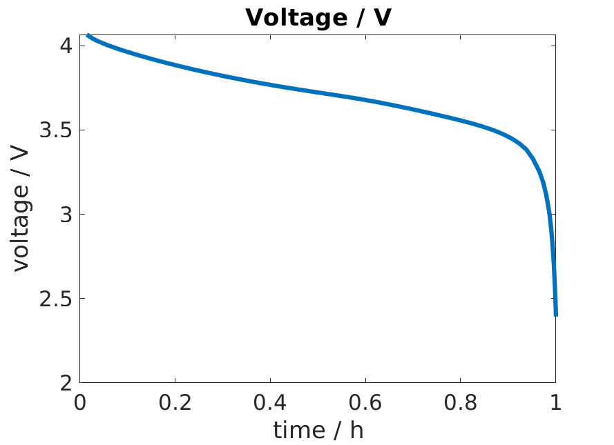

==================
Thermal Simulation
==================

BattMo support simulations with thermal coupling. Here, we look at the example given in :battmo:`runThermalExample`

First we setup our model, in the same way as before, by merging different json inputs. We use a :ref:`simple 3D
model<3dgeometry>` mainly used for demonstration.

.. code:: matlab

   %% Setup material properties
   
   jsonfilename = fullfile('ParameterData'        , ...
                           'BatteryCellParameters', ...
                           'LithiumIonBatteryCell', ...
                           'lithium_ion_battery_nmc_graphite.json');
   jsonstruct_material = parseBattmoJson(jsonfilename);
   
   jsonstruct_material.include_current_collectors = true;
   
   %% Setup geometry
   jsonfilename = fullfile('Examples'     , ...
                           'JsonDataFiles', ...
                           'geometry3d.json');
   jsonstruct_geometry = parseBattmoJson(jsonfilename);
   
   %% Setup Control
   jsonfilename = fullfile('Examples', 'JsonDataFiles', 'cc_discharge_control.json');
   jsonstruct_control = parseBattmoJson(jsonfilename);
   
   jsonstruct = mergeJsonStructs({jsonstruct_geometry , ...
                                  jsonstruct_material , ...
                                  jsonstruct_control});
   
   %% Plot the extrnal heat transfer coefficient
   
   model = setupModelFromJson(jsonstruct);
          

In the json structure
:battmofile:`lithium_ion_battery_nmc_graphite.json<ParameterData/BatteryCellParameters/LithiumIonBatteryCell/lithium_ion_battery_nmc_graphite.json#4>`,
the flag :code:`use_thermal` is set to :code:`true`, which means that the simulation will include thermal effects.

The thermal parameters are given for each component. They typically consists of

* Specific Heat Capacity
* Thermal Conducitivty

From those, we compute **effective** quantities. For the coating, it is done by processing the corresponding properties
of the constituents. The effective thermal conductivity takes into account the volume fraction.

The parameters needed to compute the heat exchange with the exterior are

* The external temperature (K)
* The external heat transfer coefficient (W/m²/s)  

The external heat transfer coefficient can take different values for each external face of the model. It will then
depend on the chosen geometrical domain. For our simple 3D model, the json interface gives us the possibility to set two
values : A default value used for all external faces which is overwritten by the value given for the tabs. In our
example we use 100 W/m²/s and 1000 W/m²/s, respectively.

Let us visualize those values. We run the following

.. code:: matlab

   % We index of the faces that are coupled to thermally to the exterior
   extfaceind = model.ThermalModel.couplingTerm.couplingfaces;
   G          = model.ThermalModel.G;
   nf         = model.ThermalModel.G.faces.num;
   
   % We create a vector with one value per face with value equal to the external heat transfer coefficient for the external
   % face
   val = NaN(nf, 1);
   val(extfaceind) = model.ThermalModel.externalHeatTransferCoefficient;
   
   figure
   plotFaceData(G, val, 'edgecolor', 'black');
   view([50, 50]);
   title('External Heat Transfer Coefficient / W/s/m^2')
   colorbar
          
and obtain

.. image:: img/externalheattransfercoef.png

We run the simulation

.. code:: matlab

   output = runBatteryJson(jsonstruct);

We obtain the standard discharge curve

Then, we extract the temperature results and the minimum and maximum values from the output

.. code:: matlab

   Tabs = PhysicalConstants.Tabs;
   
   states = output.states;
   
   Tmin = cellfun(@(state) min(state.ThermalModel.T + Tabs), states);
   Tmax = cellfun(@(state) max(state.ThermalModel.T + Tabs), states);

We plot those

.. code:: matlab

   figure
   hold on
   plot(time / hour, Tmin, 'displayname', 'min T');
   plot(time / hour, Tmax, 'displayname', 'max T');
   title('Temperature / C')
   xlabel('time / h');
   ylabel('Temperature / C');
   
   legend show
          
and obtain

We notice that there is very little temperature variation. The reason is that we have a small cell which is very thin,
with a lot of external contact where heat can be released.

Let us use a different heat exchange coefficient. We set the default heat exchange to zero so that heat exchange can only
occur through the tabs.

.. code:: matlab

   jsonstruct.ThermalModel.externalHeatTransferCoefficientTab = 100;
   jsonstruct.ThermalModel.externalHeatTransferCoefficient = 0;          

We run the computation again and obtain higher temperature.

We note also that there is less temperature gradient. We have the temperature distribution for all the cells in the model. Let us plot it for the last time step. To do so we run

.. code:: matlab
          
   state = states{end}
   figure
   plotCellData(model.ThermalModel.G, ...
                state.ThermalModel.T + Tabs);
   colorbar
   title('Temperature / C');
   view([50, 50]);

We obtain

The whole script can be viewed :ref:`here<run_temperature_example:runThermalModel>`.
